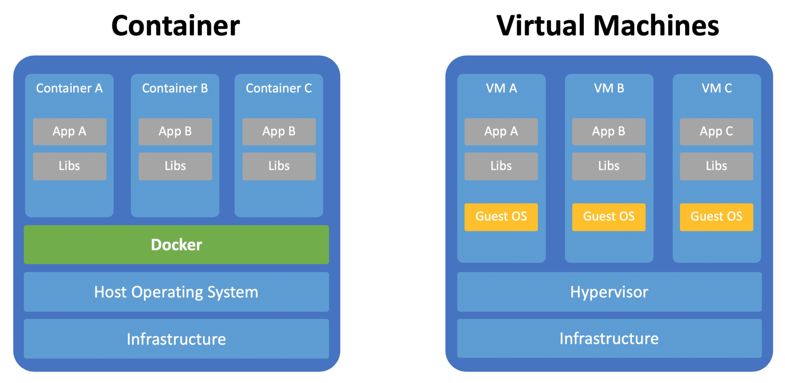

# Docker

## Docker 概述

- Docker 为什么会出现

  以前是开发人员开发 jar 包，运维做部署

  现在是开发一个人做打包部署上线

  java -> jar -> 打包项目带上环境（Docker 环境）-> Docker 仓库 -> 下载发布的对象直接运行

- Docker 的思想

  隔离，打包装箱，解决多个应用端口冲突

- Docker [文档](https://docs.docker.com/)，[仓库](https://hub.docker.com/) 

- Docker 与 虚拟机不同

  原本虚拟机技术占用资源多（Kernel + Libs + Apps），冗余步骤多，启动慢

  容器化（虚拟化）技术不是一个完整的系统（Kernel + Containers [Libs + Apps]）

  - 传统虚拟机，虚拟出一套硬件，运行一个完整的操作系统，然后再这个系统上安装和运行软件
  - 容器内的应用直接运行在宿主机的内容，容器是没有自己的内核的，也没有虚拟硬件，所以轻便
  - 每个容器间是互相隔离的，每个容器内都有一个属于自己的文件系统，互不影响

- Docker DevOps 开发&运维

  - 更快速地交付和部署

    一件运行打包镜像发布测试，一键运行

  - 更便捷地升级和扩缩容

  - 更简单的系统运维

    在容器化后，开发测试环境高度一致

  - 更高效的计算资源利用

    Docker 是内核级的虚拟化，一个物理机上可以运行很多容器实例

## Docker 安装

__Docker 的基本组成__ 


镜像 image：Docker 镜像就如同一个模板，可以通过这个模板来创建服务，通过 run 镜像创建多个容器，最终服务运行或者项目运行就是在容器中

容器 container：Docker 利用容器技术，独立运行一个组应用，通过镜像来创建（启动，停止，删除，基本命令），如同简易的 Linux 系统

仓库 repository：存放镜像的地方，分为共有和私有仓库

__安装 Docker__ 

系统版本

```shell
NAME="Ubuntu"
VERSION="16.04.7 LTS (Xenial Xerus)"
ID=ubuntu
ID_LIKE=debian
PRETTY_NAME="Ubuntu 16.04.7 LTS"
VERSION_ID="16.04"
HOME_URL="http://www.ubuntu.com/"
SUPPORT_URL="http://help.ubuntu.com/"
BUG_REPORT_URL="http://bugs.launchpad.net/ubuntu/"
VERSION_CODENAME=xenial
UBUNTU_CODENAME=xenial
```

卸载旧版本

```shell
sudo apt-get remove docker docker-engine docker.io containerd runc
```

设置仓库

```shell
sudo apt-get install \
    apt-transport-https \
    ca-certificates \
    curl \
    gnupg-agent \
    software-properties-common
```

添加 Docker 官方 GPG 密钥

```shell
curl -fsSL https://download.docker.com/linux/ubuntu/gpg | sudo apt-key add -
sudo apt-key fingerprint 0EBFCD88
```

添加 Docker 远程仓库

```shell
sudo add-apt-repository \
   "deb [arch=amd64] https://download.docker.com/linux/ubuntu \
   $(lsb_release -cs) \
   stable"
```

或者用 aliyun 仓库

```shell
sudo add-apt-repository \
   "deb [arch=amd64] http://mirrors.aliyun.com/docker-ce/linux/ubuntu/gpg \
   $(lsb_release -cs) \
   stable"
## http://mirrors.aliyun.com/docker-ce/linux/ubuntu/gpg
## https://mirrors.ustc.edu.cn/docker-ce/linux/ubuntu/gpg
```

安装 Docker 引擎

ce - community edition

ee - enterprise edition

```shell
sudo apt-get update ## 要先更新仓库目录才能定位到仓库
sudo apt-get install docker-ce docker-ce-cli containerd.io
```

测试

```shell
sudo docker run hello-world
```

- 寻找本地镜像
- 未找到时去仓库找镜像
- 从仓库拉取镜像

查看下载的镜像

```shell
docker images
```

卸载 Docker

```shell
sudo apt-get purge docker-ce docker-ce-cli containerd.io
sudo rm -rf /var/lib/docker
## Docker 默认工作路径
```

__Hello World 流程__ 

开始 -> 寻找本地寻找镜像 -> 如果有镜像，则使用本地镜像 -> 如果没有去云端下载镜像 -> 如果找不到，则返回错误，如果能找到，则下载镜像到本地并运行


__底层原理__ 

- Docker 工作原理

  Docker 是一个 Client-Server 结构的系统，Docker 的守护进程运行在主机上，通过 Socket 从客户端访问

  DockerServer 接收到 Docker-Client 的指令，就会执行这个指令

  

- Docker 为什么比虚拟机快

  - Docker 比虚拟机有更少的抽象层

    

    所以说，新建一个容器的时候，Docker 不需要像虚拟机一样重新加载一个操作系统，避免引导操作，虚拟机是加载 Guest OS，分钟级别的，而 Docker 是利用宿主机的操作系统，省略了这个复杂的过程，是秒级的

## Docker 命令

- [命令手册](https://docs.docker.com/reference/) 

- 帮助命令

  ```shell
  docker version
  docker info
  docker <command> --help
  ```

- 镜像命令

  ```shell
  docker images # 查看本地主机上的镜像
  
  root@iZgw8c1ercy5vvlhqtx2v7Z:~# docker images
  REPOSITORY    TAG       IMAGE ID       CREATED         SIZE
  hello-world   latest    bf756fb1ae65   13 months ago   13.3kB
  
  # REPOSITORY 镜像的仓库源
  # TAG 镜像的标签
  # IMAGE ID 镜像的 ID
  # CREATED 镜像创建时间
  # SIZE 镜像的大小
  
  root@iZgw8c1ercy5vvlhqtx2v7Z:~# docker images --help
  
  Usage:  docker images [OPTIONS] [REPOSITORY[:TAG]]
  
  List images
  
  Options:
    -a, --all             # 列出所有镜像
    -q, --quiet           # 只显示镜像 ID
  
  ##########
  docker search # 搜索镜像
  
  root@iZgw8c1ercy5vvlhqtx2v7Z:~# docker search mysql
  NAME                              DESCRIPTION                                     STARS     OFFICIAL   AUTOMATED
  mysql                             MySQL is a widely used, open-source relation…   10428     [OK]       
  
  #
  
  root@iZgw8c1ercy5vvlhqtx2v7Z:~# docker search --help
  
  Usage:  docker search [OPTIONS] TERM
  
  Search the Docker Hub for images
  
  Options:
    -f, --filter=STARS=3000 # 搜索出镜像是 STARS 大于 3000 的
  
  root@iZgw8c1ercy5vvlhqtx2v7Z:~# docker search mysql --filter=STARS=3000
  NAME      DESCRIPTION                                     STARS     OFFICIAL   AUTOMATED
  mysql     MySQL is a widely used, open-source relation…   10428     [OK]       
  mariadb   MariaDB is a community-developed fork of MyS…   3870      [OK]    
  
  ##########
  docker pull # 下载镜像
  
  root@iZgw8c1ercy5vvlhqtx2v7Z:~# docker pull mysql
  Using default tag: latest # 如果不写版本，默认最近
  latest: Pulling from library/mysql
  a076a628af6f: Pull complete # 分层下载，docker image 核心
  f6c208f3f991: Pull complete 
  88a9455a9165: Pull complete 
  406c9b8427c6: Pull complete 
  7c88599c0b25: Pull complete 
  25b5c6debdaf: Pull complete 
  43a5816f1617: Pull complete 
  1a8c919e89bf: Pull complete 
  9f3cf4bd1a07: Pull complete 
  80539cea118d: Pull complete 
  201b3cad54ce: Pull complete 
  944ba37e1c06: Pull complete 
  Digest: sha256:feada149cb8ff54eade1336da7c1d080c4a1c7ed82b5e320efb5beebed85ae8c # 签名
  Status: Downloaded newer image for mysql:latest
  docker.io/library/mysql:latest # 真实地址
  
  docker pull mysql
  docker pull docker.io/library/mysql:latest
  
  ##########
  docker rmi
  
  root@iZgw8c1ercy5vvlhqtx2v7Z:~# docker rmi -f mysql:latest
  # 根据容器删除
  root@iZgw8c1ercy5vvlhqtx2v7Z:~# docker rmi -f c8562eaf9d81
  # 根据镜像 ID 删除
  root@iZgw8c1ercy5vvlhqtx2v7Z:~# docker rmi -f $(docker images -aq)
  # 删除所有的镜像
  ```

- 容器命令

  有了镜像才能创建容器

  ```shell
  # 新建容器
  docker pull centos
  # 新建容器并启动
  root@iZgw8c1ercy5vvlhqtx2v7Z:~# docker run --help
  
  Usage:  docker run [OPTIONS] IMAGE [COMMAND] [ARG...]
  
  Run a command in a new container
  
  Options:
        --name string                    # 容器名称
        -d                               # 后台方式运行
        -i                               # 交互方式运行
        -p                               # 指定容器端口
        		-p ip:8080:8081            # 主机 ip:8080 映射到容器端口 8081
        		-p 8080:8081			   # 主机 8080 映射到容器端口 8081
        		-p 8081					   # 仅指定容器端口
        		8081
        -P                               # 随机指定端口
  
  # 启动并进入容器
  root@iZgw8c1ercy5vvlhqtx2v7Z:~# docker run -it centos /bin/bash
  [root@1442a5776366 /]# 
  
  # 退出容器
  [root@1442a5776366 /]# exit
  
  # 查看正在运行和历史运行容器
  root@iZgw8c1ercy5vvlhqtx2v7Z:~# docker ps
  CONTAINER ID   IMAGE     COMMAND   CREATED   STATUS    PORTS     NAMES
  root@iZgw8c1ercy5vvlhqtx2v7Z:~# docker ps -a
  CONTAINER ID   IMAGE          COMMAND       CREATED         STATUS                          PORTS     NAMES
  1442a5776366   centos         "/bin/bash"   5 minutes ago   Exited (0) About a minute ago             mystifying_haibt
  dcc3a691cd63   bf756fb1ae65   "/hello"      2 days ago      Exited (0) 2 days ago                     agitated_wescoff
  root@iZgw8c1ercy5vvlhqtx2v7Z:~# docker ps -a -n=1
  CONTAINER ID   IMAGE     COMMAND       CREATED         STATUS                     PORTS     NAMES
  1442a5776366   centos    "/bin/bash"   8 minutes ago   Exited (0) 4 minutes ago             mystifying_haibt
  root@iZgw8c1ercy5vvlhqtx2v7Z:~# docker ps -a -q
  1442a5776366
  dcc3a691cd63
  
  # 退出容器但不停止
  ctrl + P + Q
  
  root@iZgw8c1ercy5vvlhqtx2v7Z:~# docker run -it centos /bin/bash
  [root@855d3cf950c2 /]# root@iZgw8c1ercy5vvlhqtx2v7Z:~# docker ps
  CONTAINER ID   IMAGE     COMMAND       CREATED          STATUS          PORTS     NAMES
  855d3cf950c2   centos    "/bin/bash"   13 seconds ago   Up 13 seconds             laughing_einstein
  root@iZgw8c1ercy5vvlhqtx2v7Z:~# 
  
  # 删除容器
  
  root@iZgw8c1ercy5vvlhqtx2v7Z:~# docker rm -f $(docker ps -aq)
  855d3cf950c2
  1442a5776366
  dcc3a691cd63
  root@iZgw8c1ercy5vvlhqtx2v7Z:~# docker ps -aq | xargs docker rm -f
  
  # 启动和停止容器操作
  docker start id
  docker restart id
  docker stop id
  docker kill id
  
  root@iZgw8c1ercy5vvlhqtx2v7Z:~# docker run -it centos /bin/bash
  [root@c58e457a474b /]# exit
  exit
  root@iZgw8c1ercy5vvlhqtx2v7Z:~# docker ps -aq
  c58e457a474b
  root@iZgw8c1ercy5vvlhqtx2v7Z:~# docker start c58e457a474b
  c58e457a474b
  root@iZgw8c1ercy5vvlhqtx2v7Z:~# docker ps
  CONTAINER ID   IMAGE     COMMAND       CREATED          STATUS         PORTS     NAMES
  c58e457a474b   centos    "/bin/bash"   46 seconds ago   Up 5 seconds             strange_hertz
  ```

- 后台启动命令

  ```shell
  root@iZgw8c1ercy5vvlhqtx2v7Z:~# docker run -d centos
  328f4eb5b61c35746e8c0fd6d8d4f4cf577c054304c8c44b8ddfc82d7d9de655
  root@iZgw8c1ercy5vvlhqtx2v7Z:~# docker ps
  CONTAINER ID   IMAGE     COMMAND   CREATED   STATUS    PORTS     NAMES
  
  # 问题：容器停止了
  # docker 是容器使用后台运行必须有一个前台进程，发现没有提供服务，就会自动停止
  ```

- 查看日志

  ```shell
  root@iZgw8c1ercy5vvlhqtx2v7Z:~# docker logs --help
  
  Usage:  docker logs [OPTIONS] CONTAINER
  
  Fetch the logs of a container
  
  Options:
        --details        Show extra details provided to logs
    -f, --follow         Follow log output
        --since string   Show logs since timestamp (e.g. 2013-01-02T13:23:37Z) or relative (e.g. 42m for 42 minutes)
    -n, --tail string    Number of lines to show from the end of the logs (default "all")
    -t, --timestamps     Show timestamps
        --until string   Show logs before a timestamp (e.g. 2013-01-02T13:23:37Z) or relative (e.g. 42m for 42 minutes)
  
  root@iZgw8c1ercy5vvlhqtx2v7Z:~# docker run -it centos /bin/bash
  root@iZgw8c1ercy5vvlhqtx2v7Z:~# docker logs -f -t --tail 10 c58e457a474b
  2021-01-30T01:05:51.365084750Z [root@c58e457a474b /]# exit
  2021-01-30T01:05:51.365137582Z exit
  2021-01-30T01:09:12.040494759Z [root@c58e457a474b /]# exit
  
  root@iZgw8c1ercy5vvlhqtx2v7Z:~# docker run -d centos /bin/sh -c "while true;do echo hello;sleep 1;done"
  8682fda50151d656c6d83a89f516ac76915482c88cc6bd6eb182769e5d0a7c6f
  root@iZgw8c1ercy5vvlhqtx2v7Z:~# docker ps
  CONTAINER ID   IMAGE     COMMAND                  CREATED         STATUS        PORTS     NAMES
  8682fda50151   centos    "/bin/sh -c 'while t…"   2 seconds ago   Up 1 second             sharp_bose
  root@iZgw8c1ercy5vvlhqtx2v7Z:~# 
  root@iZgw8c1ercy5vvlhqtx2v7Z:~# docker logs -f -t --tail 10 8682fda50151
  2021-01-30T01:19:05.241247729Z hello
  2021-01-30T01:19:06.243084928Z hello
  2021-01-30T01:19:07.244913679Z hello
  2021-01-30T01:19:08.246829059Z hello
  2021-01-30T01:19:09.248641262Z hello
  2021-01-30T01:19:10.250703186Z hello
  2021-01-30T01:19:11.252424809Z hello
  2021-01-30T01:19:12.254269653Z hello
  2021-01-30T01:19:13.256272080Z hello
  2021-01-30T01:19:14.258074450Z hello
  2021-01-30T01:19:15.260171940Z hello
  2021-01-30T01:19:16.262073359Z hello
  ...
  ```

- 查看容器中的进程信息

  ```shell
  # top
  root@iZgw8c1ercy5vvlhqtx2v7Z:~# docker run -d centos /bin/sh -c "while true;do echo hello;sleep 1;done"
  5dbe044cacdd69be9549f4a29c3773d37743e114f46da38f35456d4cb093240c
  root@iZgw8c1ercy5vvlhqtx2v7Z:~# docker ps
  CONTAINER ID   IMAGE     COMMAND                  CREATED         STATUS         PORTS     NAMES
  5dbe044cacdd   centos    "/bin/sh -c 'while t…"   5 seconds ago   Up 4 seconds             ecstatic_liskov
  root@iZgw8c1ercy5vvlhqtx2v7Z:~# docker top 5dbe044cacdd
  UID                 PID                 PPID                C                   STIME               TTY                 TIME                CMD
  root                7918                7897                0                   01:22               ?                   00:00:00            /bin/sh -c while true;do echo hello;sleep 1;done
  root                7989                7918                0                   01:22               ?                   00:00:00            /usr/bin/coreutils --coreutils-prog-shebang=sleep /usr/bin/sleep 1
  
  ```

- 查看镜像元数据

  ```shell
  root@iZgw8c1ercy5vvlhqtx2v7Z:~# docker inspect 5dbe044cacdd
  [
      {
          "Id": "5dbe044cacdd69be9549f4a29c3773d37743e114f46da38f35456d4cb093240c",
          "Created": "2021-01-30T01:22:04.592832652Z",
          "Path": "/bin/sh",
          "Args": [
              "-c",
              "while true;do echo hello;sleep 1;done"
          ],
          "State": {
              "Status": "running",
              "Running": true,
              "Paused": false,
              "Restarting": false,
              "OOMKilled": false,
              "Dead": false,
              "Pid": 7918,
              "ExitCode": 0,
              "Error": "",
              "StartedAt": "2021-01-30T01:22:04.986498486Z",
              "FinishedAt": "0001-01-01T00:00:00Z"
          },
          "Image": "sha256:300e315adb2f96afe5f0b2780b87f28ae95231fe3bdd1e16b9ba606307728f55",
          "ResolvConfPath": "/var/lib/docker/containers/5dbe044cacdd69be9549f4a29c3773d37743e114f46da38f35456d4cb093240c/resolv.conf",
          "HostnamePath": "/var/lib/docker/containers/5dbe044cacdd69be9549f4a29c3773d37743e114f46da38f35456d4cb093240c/hostname",
          "HostsPath": "/var/lib/docker/containers/5dbe044cacdd69be9549f4a29c3773d37743e114f46da38f35456d4cb093240c/hosts",
          "LogPath": "/var/lib/docker/containers/5dbe044cacdd69be9549f4a29c3773d37743e114f46da38f35456d4cb093240c/5dbe044cacdd69be9549f4a29c3773d37743e114f46da38f35456d4cb093240c-json.log",
          "Name": "/ecstatic_liskov",
          "RestartCount": 0,
          "Driver": "overlay2",
          "Platform": "linux",
          "MountLabel": "",
          "ProcessLabel": "",
          "AppArmorProfile": "docker-default",
          "ExecIDs": null,
          "HostConfig": {
              "Binds": null,
              "ContainerIDFile": "",
              "LogConfig": {
                  "Type": "json-file",
                  "Config": {}
              },
              "NetworkMode": "default",
              "PortBindings": {},
              "RestartPolicy": {
                  "Name": "no",
                  "MaximumRetryCount": 0
              },
              "AutoRemove": false,
              "VolumeDriver": "",
              "VolumesFrom": null,
              "CapAdd": null,
              "CapDrop": null,
              "CgroupnsMode": "host",
              "Dns": [],
              "DnsOptions": [],
              "DnsSearch": [],
              "ExtraHosts": null,
              "GroupAdd": null,
              "IpcMode": "private",
              "Cgroup": "",
              "Links": null,
              "OomScoreAdj": 0,
              "PidMode": "",
              "Privileged": false,
              "PublishAllPorts": false,
              "ReadonlyRootfs": false,
              "SecurityOpt": null,
              "UTSMode": "",
              "UsernsMode": "",
              "ShmSize": 67108864,
              "Runtime": "runc",
              "ConsoleSize": [
                  0,
                  0
              ],
              "Isolation": "",
              "CpuShares": 0,
              "Memory": 0,
              "NanoCpus": 0,
              "CgroupParent": "",
              "BlkioWeight": 0,
              "BlkioWeightDevice": [],
              "BlkioDeviceReadBps": null,
              "BlkioDeviceWriteBps": null,
              "BlkioDeviceReadIOps": null,
              "BlkioDeviceWriteIOps": null,
              "CpuPeriod": 0,
              "CpuQuota": 0,
              "CpuRealtimePeriod": 0,
              "CpuRealtimeRuntime": 0,
              "CpusetCpus": "",
              "CpusetMems": "",
              "Devices": [],
              "DeviceCgroupRules": null,
              "DeviceRequests": null,
              "KernelMemory": 0,
              "KernelMemoryTCP": 0,
              "MemoryReservation": 0,
              "MemorySwap": 0,
              "MemorySwappiness": null,
              "OomKillDisable": false,
              "PidsLimit": null,
              "Ulimits": null,
              "CpuCount": 0,
              "CpuPercent": 0,
              "IOMaximumIOps": 0,
              "IOMaximumBandwidth": 0,
              "MaskedPaths": [
                  "/proc/asound",
                  "/proc/acpi",
                  "/proc/kcore",
                  "/proc/keys",
                  "/proc/latency_stats",
                  "/proc/timer_list",
                  "/proc/timer_stats",
                  "/proc/sched_debug",
                  "/proc/scsi",
                  "/sys/firmware"
              ],
              "ReadonlyPaths": [
                  "/proc/bus",
                  "/proc/fs",
                  "/proc/irq",
                  "/proc/sys",
                  "/proc/sysrq-trigger"
              ]
          },
          "GraphDriver": {
              "Data": {
                  "LowerDir": "/var/lib/docker/overlay2/2e333a47c183bacb28aa8bd9c961fdba7b34701c261e54c5426efe203097d734-init/diff:/var/lib/docker/overlay2/3c79ffe5c621f9003d8466f640b8d9177fe3641bf071c472ce8c7fe3711fb62a/diff",
                  "MergedDir": "/var/lib/docker/overlay2/2e333a47c183bacb28aa8bd9c961fdba7b34701c261e54c5426efe203097d734/merged",
                  "UpperDir": "/var/lib/docker/overlay2/2e333a47c183bacb28aa8bd9c961fdba7b34701c261e54c5426efe203097d734/diff",
                  "WorkDir": "/var/lib/docker/overlay2/2e333a47c183bacb28aa8bd9c961fdba7b34701c261e54c5426efe203097d734/work"
              },
              "Name": "overlay2"
          },
          "Mounts": [],
          "Config": {
              "Hostname": "5dbe044cacdd",
              "Domainname": "",
              "User": "",
              "AttachStdin": false,
              "AttachStdout": false,
              "AttachStderr": false,
              "Tty": false,
              "OpenStdin": false,
              "StdinOnce": false,
              "Env": [
                  "PATH=/usr/local/sbin:/usr/local/bin:/usr/sbin:/usr/bin:/sbin:/bin"
              ],
              "Cmd": [
                  "/bin/sh",
                  "-c",
                  "while true;do echo hello;sleep 1;done"
              ],
              "Image": "centos",
              "Volumes": null,
              "WorkingDir": "",
              "Entrypoint": null,
              "OnBuild": null,
              "Labels": {
                  "org.label-schema.build-date": "20201204",
                  "org.label-schema.license": "GPLv2",
                  "org.label-schema.name": "CentOS Base Image",
                  "org.label-schema.schema-version": "1.0",
                  "org.label-schema.vendor": "CentOS"
              }
          },
          "NetworkSettings": {
              "Bridge": "",
              "SandboxID": "d52d936066324433af90e0b229e03ae8d422aed67ce804824e70f17b29f195c4",
              "HairpinMode": false,
              "LinkLocalIPv6Address": "",
              "LinkLocalIPv6PrefixLen": 0,
              "Ports": {},
              "SandboxKey": "/var/run/docker/netns/d52d93606632",
              "SecondaryIPAddresses": null,
              "SecondaryIPv6Addresses": null,
              "EndpointID": "aa0d1d42eeb2d4352dca7f923f4ae54c58d35249f5ab58a00a58c98ede5ce87b",
              "Gateway": "172.18.0.1",
              "GlobalIPv6Address": "",
              "GlobalIPv6PrefixLen": 0,
              "IPAddress": "172.18.0.2",
              "IPPrefixLen": 16,
              "IPv6Gateway": "",
              "MacAddress": "02:42:ac:12:00:02",
              "Networks": {
                  "bridge": {
                      "IPAMConfig": null,
                      "Links": null,
                      "Aliases": null,
                      "NetworkID": "b3f8a25aca23eb1b7866c21cc2b531ef6c2e97030c31e249653b8e8e95869784",
                      "EndpointID": "aa0d1d42eeb2d4352dca7f923f4ae54c58d35249f5ab58a00a58c98ede5ce87b",
                      "Gateway": "172.18.0.1",
                      "IPAddress": "172.18.0.2",
                      "IPPrefixLen": 16,
                      "IPv6Gateway": "",
                      "GlobalIPv6Address": "",
                      "GlobalIPv6PrefixLen": 0,
                      "MacAddress": "02:42:ac:12:00:02",
                      "DriverOpts": null
                  }
              }
          }
      }
  ]
  ```

- 进入当前正在运行的容器

  ```shell
  # 方式一
  docker exec -it id bashShell
  root@iZgw8c1ercy5vvlhqtx2v7Z:~# docker exec -it 5dbe044cacdd /bin/bash
  
  # 方式二
  docker attach id
  root@iZgw8c1ercy5vvlhqtx2v7Z:~# docker attach 5dbe044cacdd
  
  # 第一种方法进入容器后开启一个新的终端
  # 第二种方法进入容器正在执行的终端
  ```

- 从容器内拷贝文件到主机上

  ```shell
  docker cp id:path hostpath
  root@iZgw8c1ercy5vvlhqtx2v7Z:/home# docker cp 6f09366e8811:/home/test.txt /home/
  root@iZgw8c1ercy5vvlhqtx2v7Z:/home# docker cp /home/test.txt 6f09366e8811:/home/
  ```

- 小结

  

- Nginx 部署

  ```shell
  # 搜索镜像
  docker search nginx
  # 下载镜像
  docker pull nginx
  # 运行镜像 -d 后台运行 --name 起名 -p 暴露端口 主机端口:内部端口
  root@iZgw8c1ercy5vvlhqtx2v7Z:~# docker run -d --name nginx01 -p 10000:80 nginx
  # 本机自测
  root@iZgw8c1ercy5vvlhqtx2v7Z:~# curl localhost:10000
  # 进入容器
  root@iZgw8c1ercy5vvlhqtx2v7Z:~# docker exec -it nginx01 /bin/bash
  ```

- Tomcat 部署

  ```shell
  
  ```

  

## Docker 镜像

## Docker 容器数据卷

## DockerFile

## Docker 网络原理

## IDEA 整合 Docker

## Docker Compose

## Docker Swarm

## CI/CD  jenkins