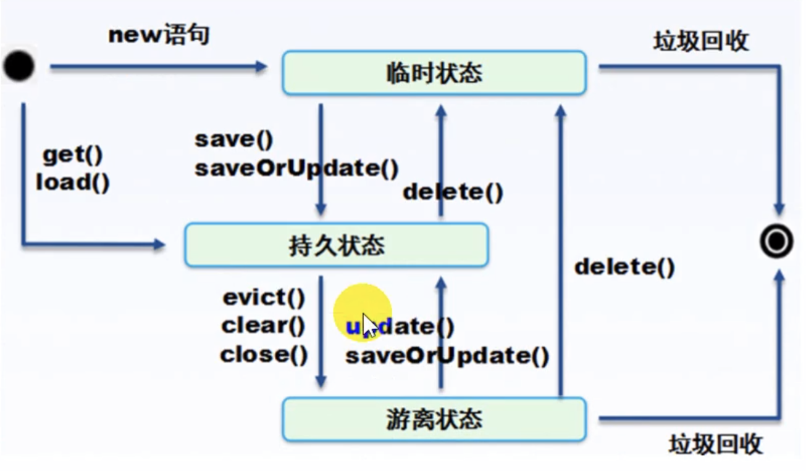

# Hibernate

## 1. Hibernate 初识

### 1.1 什么是 Hibernate

Hibernate 是一个持久化 ORM 框架，解决持久化操作，使得程序员可以专注于业务开发，提高开发效率，并具有可靠的移植性，降低了系统的耦合度

__持久化（persistence）__

- 持久，即把数据保存到可以永久保存的设备中（比如磁盘）
- 持久化的主要应用是将内存中的数据储存在关系型数据库中，当然也可以储存在磁盘，XML 数据文件中等，Hibernate 中叫做加载
  - 狭义概念：数据存储在物理介质中不会丢失
  - 广义概念：对数据的 CRUD 操作都叫做持久化

__ORM__ 

Object Relation Mapping：对象（JavaBean）关系（关系型数据库）映射，它的作用是在关系型数据库和对象之间做一个映射，这样我们在具体操作数据库的时候，就不需要再去和复杂的 sql 语句打交道，只要像平时操作对象一样操作它就可以了

### 1.2 为什么要做持久化和 ORM 设计

- 代码复杂

  ​		用 JDBC 的 API 访问数据库，代码量较大，特别是访问字段较多表的时候，代码显得繁琐，累赘，容易出错，程序员需要消耗大量的时间精力去编写具体数据库访问的 sql 语句，还要十分小心其中大量重复的源代码是否有疏漏，并不能集中精力于业务逻辑的开发上面

  ​		ORM 则建立了 Java 对象与数据库对象之间的映射关系，程序员不需要编写复杂的 sql 语句，直接操作 Java 对象即可，大大降低了代码量，也使程序员更加专注于业务逻辑的实现

- 数据库连接的问题

  ​		采用 JDBC 编程，必须保证各种关系之间不能出错

  ​		ORM 建立 Java 对象与数据库对象关系映射同时，也自动根据数据库对象之间的关系创建 Java 对象的关系，并且提供了维持这些关系完整，有效的机制

- 耦合度

  ​		JDBC 属于数据访问层，但使用 JDBC 时，程序员必须知道后台用的是什么数据库，有哪些表，各个表有哪些字段，各个字段的类型是什么，表与表之间什么关系，创建了什么索引等等与后台数据库相关的信息，相当于软件程序员兼职数据库 DBA

  ​		使用 ORM 技术，可以将数据库层完全屏蔽，呈现给程序员的只有 Java 对象，程序员只要根据业务逻辑的需要，调用 Java 对象的 Getter 和 Setter 方法，即可实现对后台数据库的操作，程序员不必知道后台采用什么样的数据库，有哪些表，有什么字段，表与表之间有什么关系

  ​		于是，系统设计人员把 ORM 搭建好以后，把 Java 对象交给程序员去实现业务逻辑，使持久层与数据库层清晰分界

## 2. Hibernate 入门

### 2.1 Hibernate 基本配置

hibernate.cfg.xml 配置文件

```xml-dtd
<?xml version="1.0" encoding="UTF-8" ?>
<!DOCTYPE hibernate-configuration PUBLIC
        "-//Hibernate/Hibernate Configuration DTD 3.0//EN"
        "http://www.hibernate.org/dtd/hibernate-configuration-3.0.dtd">
<hibernate-configuration xmlns="http://www.hibernate.org/xsd/hibernate-configuration">
    <session-factory>
        <property name="connection.driver_class">className</property>
        <property name="connection.url">url</property>
        <property name="connection.username">username</property>
        <property name="connection.password">password</property>
		<property name="dialect">org.hibernate.dialect.MySQL8Dialect</property>
    </session-factory>
</hibernate-configuration>
```

maven 配置读取子配置文件

```xml-dtd
<?xml version="1.0" encoding="UTF-8"?>
<project xmlns="http://maven.apache.org/POM/4.0.0"
         xmlns:xsi="http://www.w3.org/2001/XMLSchema-instance"
         xsi:schemaLocation="http://maven.apache.org/POM/4.0.0 http://maven.apache.org/xsd/maven-4.0.0.xsd">

<!-- .... -->

    <build>
        <finalName>hibernate-01</finalName>

        <resources>
            <resource>
                <directory>src/main/resources</directory>
            </resource>
            <resource>
                <directory>src/main/java</directory>
                <includes>
                    <include>**/*.xml</include>
                </includes>
                <filtering>false</filtering>
            </resource>
        </resources>
    </build>
</project>
```

创建 pojo User

```java
public class User {
    private Integer uid;
    private String uname;
    private Integer balance;

    public User() {}

    public User(Integer uid, String uname, Integer balance) {
        this.uid = uid;
        this.uname = uname;
        this.balance = balance;
    }

    public Integer getUid() {
        return uid;
    }

    public void setUid(Integer uid) {
        this.uid = uid;
    }

    public String getUname() {
        return uname;
    }

    public void setUname(String uname) {
        this.uname = uname;
    }

    public Integer getBalance() {
        return balance;
    }

    public void setBalance(Integer balance) {
        this.balance = balance;
    }

    @Override
    public String toString() {
        return "User{"+this.uname+","+this.balance+"}";
    }
}
```

在同级下创建 User.hbm.xml

```xml-dtd
<?xml version="1.0" encoding="UTF-8" ?>
<!DOCTYPE hibernate-mapping PUBLIC
        "-//hibernate/Hibernate Mapping DTD 3.0//EN"
        "http://www.hibernate.org/xsd/hibernate-mapping-3.0.dtd">
<hibernate-mapping>
    <class name="com.ayy.pojo.User" table="user_table">
        <id name="uid">
			<generator class="native"></generator> <!-- 主键自增策略 -->
        </id>
        <property name="uname"/>
        <property name="balance"/>
    </class>
</hibernate-mapping>
```

如果表的字段名和对象不符，在 property 中加入 column 属性

然后再原来 hibernate.cfg.xml 中配置 mapping

```xml
<hibernate-configuration xmlns="http://www.hibernate.org/xsd/hibernate-configuration">
    <session-factory>
        <!-- ... -->
        <mapping resource="com/ayy/pojo/User.hbm.xml"/>
    </session-factory>
</hibernate-configuration>
```

测试用例

```java
@Test
public void HibernateConfigTest(){
	StandardServiceRegistry registry = null;
    SessionFactory sessionFactory = null;
	Session session = null;
    Transaction tx = null;
	try {
        registry = new StandardServiceRegistryBuilder()
				.configure()
			    .build();
		sessionFactory = new MetadataSources(registry)
	            .buildMetadata()
		        .buildSessionFactory();
	    session = sessionFactory.openSession();
        tx = session.beginTransaction();
        User user = new User();
		user.setUname("Hibernate1");
	    user.setBalance(1000);
        session.save(user);
		tx.commit();
	}catch (Exception e){
        tx.rollback();
    }finally {
        if (session!=null && session.isOpen()) {
            session.close();
        }
    }
}
```

Hibernate 3 写法

```java
Configuration cfg = new Configuration().configure();
SessionFactory sf = cfg.buildSessionFactory();
```

Hibernate 4 写法

```java
Configuration cfg = new Configuration().configure();
StandardServiceRegistry registry = new StandardServiceRegistryBuilder()
    .applySettings(cfg.getProperties()).build();
SessionFactory sessionFactory = cfg.buildSessionFactory(registry);
```

数据库更新方式

```xml
<property name="hibernate.hbm2ddl.auto">update</property>
```

工作中一般用 update

- validate 没有表就会报错

- create-drop 为每次执行前删除表并重新创建
- create 每次重新建表
- update 如果有表就插入，没有就创建表

## 3. 5 大关键接口

### 3.1 Configuration (Hibernate 3/4)

负责 Hibernate 的配置工作，创建 SessionFactory 对象，在 Hibernate 启动过程中，Configuration 类的实例首先定位在映射文件位置，读取配置，然后创建 SessionFactory 对象

```java
@Test
public void testConfig(){
//    Configuration cfg = new Configuration();
    Configuration cfg = new Configuration().configure();
//    Configuration cfg = new Configuration().configure("others.cfg.xml");
//    cfg.addProperties();
//    cfg.addResource();
}
```

### 3.2 SessionFactory

SessionFactory 接口负责初始化 Hibernate，它充当数据存储源的代理，使用工厂模式创建 Session 对象，需要注意的是 SessionFactory 并不是轻量级的，一般情况下，一个项目通常只需要一个 SessionFactory 就够，当需要操作多个数据库时，可以为每个数据库指定一个 SessionFactory

```java
@Test
public void testSessionFactory(){
    StandardServiceRegistry registry = new StandardServiceRegistryBuilder()
			.configure()
	        .build();
    SessionFactory sessionFactory = new MetadataSources(registry)
			.buildMetadata()
	        .buildSessionFactory();
}
```

### 3.3 Session

Session 接口对于 Hibernate 开发人员来说是一个最重要的接口，在 Hibernate 中，实例化的 Session 是一个轻量级的类，创建和销毁它都不会占用很多资源，这个在实际项目中非常重要，因为在程序中，可能不断地创建以及销毁 Session 对象，如果 Session 的开销太大，会给系统带来不良影响，但是 Session 对象是非线程安全的，因此在设计中，最好是一个线程只创建一个 Session 对象，Session 可以看作介于数据连接和事务管理一种中间接口，我们可以将 Session 想象成一个持久化对象的缓冲区，Hibernate 能检测到这些持久对象的改变，并及时刷新数据库，我们有时也称 Session 是一个持久层管理器，因为 Session 负责执行被持久化对象的增，删，改，查操作，类似于 JDBC 的 Connection 和 Statement，注入存储持久对象至数据库，以及从数据库中获得他们，需要注意的是，Hibernate 的 Session 不同于 JSP 应用中的 HttpSession，在 Hibernate 中，我们使用 Session 这个术语时，指的是 HIbernate 自己的 Session

```java
@Test
public void testSession(){
	StandardServiceRegistry registry = new StandardServiceRegistryBuilder()
			.configure()
	        .build();
    SessionFactory sessionFactory = new MetadataSources(registry)
			.buildMetadata()
	        .buildSessionFactory();
    Session session = sessionFactory.openSession();
}
```

### 3.4 Transaction

负责事务的相关操作，它代表的是 Hibernate 的事务，本质上也是数据库事务，一般在 Hibernate 的增删改中出现，但是使用 Hibernate 一般使用 Spring 去管理事务

```java
@Test
public void testTransaction(){
    StandardServiceRegistry registry = new StandardServiceRegistryBuilder()
			.configure()
	        .build();
    SessionFactory sessionFactory = new MetadataSources(registry)
			.buildMetadata()
	        .buildSessionFactory();
    Session session = sessionFactory.openSession();
    Transaction tx1 = session.beginTransaction();
    Transaction tx2 = session.getTransaction();
    tx2.begin();
}
```

### 3.5 Query

负责执行给中数据查询功能，它可以使用 Hibernate 特有的 HQL 语言和 SQL 语言两种方式

## 4. Hibernate 配置文件

Hibernate 中配置主要分两种：一种包含了 Hibernate 与数据库的基本连接信息，在 Hibernate 工作的初始阶段，这些信息被先后加载到 Configuration 和 SessionFactory 实例，另一种包含了 Hibernate 的基本映射信息，即系统的每一个类都与其对应的数据库表之间的关联信息，在 Hibernate 的工作初始阶段，这些信息通过 hibernate.cfg.xml 的 mapping 节点被加载到 Configuration 和 SessionFactory 实例，这两种文件信息包含了 Hibernate 的所有运行期参数

### 4.1 Hibernate 核心配置

- hibernate.properties

  ```java
  Configuration cfg = new Configuration();
  cfg.addProperties();
  cfg.addResource("hibernate.cfg.xml");
  ```

- hibernate.cfg.xml

  ```xml-dtd
  <?xml version="1.0" encoding="utf-8" ?>
  <!--
    ~ Hibernate, Relational Persistence for Idiomatic Java
    ~
    ~ License: GNU Lesser General Public License (LGPL), version 2.1 or later.
    ~ See the lgpl.txt file in the root directory or <http://www.gnu.org/licenses/lgpl-2.1.html>.
    -->
  <!DOCTYPE hibernate-configuration PUBLIC
  	"-//Hibernate/Hibernate Configuration DTD 3.0//EN"
  	"http://www.hibernate.org/dtd/hibernate-configuration-3.0.dtd">
  
  <!-- 初始化 Hibernate -->
  <hibernate-configuration>
  	<!-- 配置 Session 工厂 -->
  	<session-factory>
  		<!-- 初始化 JDBC -->
          <property name="connection.driver_class">com.mysql.cj.jdbc.Driver</property>
          <property name="connection.url">jdbc:mysql:///jdbc_test?rewriteBatchedStatements=true</property>
          <property name="connection.username">root</property>
          <property name="connection.password">root</property>
  		<!-- 方言 -->
          <property name="dialect">org.hibernate.dialect.MySQL8Dialect</property>
  		<!-- 数据库生成方式 -->
        <property name="hibernate.hbm2ddl.auto">update</property>
  		<!-- 打印 SQL -->
          <property name="show_sql">true</property>
  		<!-- 格式化 SQL -->
          <property name="format_sql">true</property>
  		<!-- 关联对象配置文件 -->
          <mapping resource="com/ayy/pojo/User.hbm.xml"/>
      </session-factory>
  </hibernate-configuration>
  ```
  

### 4.2 *.hbm.xml 基本配置

```xml-dtd
<?xml version="1.0" encoding="UTF-8" ?>
<!DOCTYPE hibernate-mapping PUBLIC
        "-//hibernate/Hibernate Mapping DTD 3.0//EN"
        "http://www.hibernate.org/xsd/hibernate-mapping-3.0.dtd">
<!-- 
	package : 包全限定名
-->
<hibernate-mapping>
	<!-- 
		class : 在有包名时，可以只有类名，否则要加全限定名
		table : 表名
	-->
    <class name="com.ayy.pojo.User" table="user_table">
		<!-- 
			id name : 主键对应的类中的属性
			id column : 表中列名
		-->
        <id name="uid">
			<!-- 
				generator class 主键自增策略:
					native : 根据数据库底层自己选择 increment/identity/sequence
					increment : 用于 int, short, long 集群下不要使用
					identity : DB2, MySQL, SQL Server int, short, long
					sequence : DB2, PostgreSQL, Oracle int, short, long 
					hilo : long, short, int
					uuid : 128-bits uuid
					assigned : 不指定生成策略
					foreign : 关联对象
			-->
            <generator class="native"/>
        </id>
		<!-- 
			name : 类属性名
			column : 表中列名
			type : 类型
			length : 长度
			not-null : 非空
		-->
        <property name="uname" column="uname"/>
		<property name="balance">
			<column name="balance"/>
		</property>
    </class>
</hibernate-mapping>
```

### 4.3 日志配置

```properties
#
# Hibernate, Relational Persistence for Idiomatic Java
#
# License: GNU Lesser General Public License (LGPL), version 2.1 or later.
# See the lgpl.txt file in the root directory or <http://www.gnu.org/licenses/lgpl-2.1.html>.
#

### direct log messages to stdout ###
### 输出 stdout 日志到控制台
### org.apache.log4j.ConsoleAppender 控制台
### org.apache.log4j.FileAppender 文件
### org.apache.log4j.DailyRollingFileAppender 每天产生一个日志文件
### org.apache.log4j.RollingFileAppender 文件大小达到指定尺寸时，产生一个新文件
### org.apache.log4j.WriterAppender 将日志信息以流的形式发送到任何地方
log4j.appender.stdout=org.apache.log4j.ConsoleAppender

### 输出到控制台的方式
log4j.appender.stdout.Target=System.out

### 日志布局样式
### org.apache.log4j.HTMLLayout 以 HTML 表格形式布局
### org.apache.log4j.PatternLayout 灵活指定布局方式
### org.apache.log4j.SimpleLayout 包含日志信息级别和信息字符串
### org.apache.log4j.TTCCLayout 包含日志产生的时间，线程，类别等信息
log4j.appender.stdout.layout=org.apache.log4j.PatternLayout

### 灵活输出格式定义
### %d 输出日志时间点的日期或时间，默认格式为 ISO8601
### 	也可以指定格式 %d{yyy MMM dd HH:mm:ss, SSS}
### %p 输出优先级 DEBUG INFO WARN ERROR FATAL
### %c 输出所属类目（通常为类全限定名）
### %l 输出日志发生位置，包括类名，线程，以及在代码中的行数
### %m 输出代码中指定的信息
### %n 输出一个回车换行符
### %r 输出自应用启动到输出该 log 信息的毫秒数
### %t 输出产生该日志的线程名
log4j.appender.stdout.layout.ConversionPattern=%d{ABSOLUTE} %5p %c{1}:%L - %m%n

### direct messages to file hibernate.log ###
#log4j.appender.file=org.apache.log4j.FileAppender
#log4j.appender.file.File=hibernate.log
#log4j.appender.file.layout=org.apache.log4j.PatternLayout
#log4j.appender.file.layout.ConversionPattern=%d{ABSOLUTE} %5p %c{1}:%L - %m%n

### set log levels - for more verbose logging change 'info' to 'debug' ###
### debug > info > warn > error

log4j.rootLogger=warn, stdout

#log4j.logger.org.hibernate=info
log4j.logger.org.hibernate=debug

### log HQL query parser activity
#log4j.logger.org.hibernate.hql.ast.AST=debug

### log just the SQL
#log4j.logger.org.hibernate.SQL=debug

### log JDBC bind parameters ###
log4j.logger.org.hibernate.type=info
#log4j.logger.org.hibernate.type=debug

### log schema export/update ###
log4j.logger.org.hibernate.tool.hbm2ddl=debug

### log HQL parse trees
#log4j.logger.org.hibernate.hql=debug

### log cache activity ###
#log4j.logger.org.hibernate.cache=debug

### log transaction activity
#log4j.logger.org.hibernate.transaction=debug

### log JDBC resource acquisition
#log4j.logger.org.hibernate.jdbc=debug

### enable the following line if you want to track down connection ###
### leakages when using DriverManagerConnectionProvider ###
#log4j.logger.org.hibernate.connection.DriverManagerConnectionProvider=trace
```

log4j 导入

```xml
<dependency>
	<groupId>org.slf4j</groupId>
	<artifactId>slf4j-api</artifactId>
	<version>1.7.25</version>
</dependency>
<dependency>
    <groupId>org.slf4j</groupId>
    <artifactId>slf4j-log4j12</artifactId> <!-- 只能用于 log4j 1.2 -->
    <version>1.7.25</version>
</dependency>
<dependency>
    <groupId>log4j</groupId>
    <artifactId>log4j</artifactId>
    <version>1.2.17</version>
</dependency>
```

## 5. Hibernate 对象生命周期

### 5.1 对象的状态和生命周期

Hibernate 中对象有三种状态：瞬时状态（Transient），持久状态（Persistent），游离状态（Detached）

- 瞬时状态：刚刚被 new 语句创建，还没有被持久化，不处于 Session 中，处于临时状态的 java 对象被称为临时对象，数据库中没有
- 持久化状态：已经被持久化，加入到 Session 中，处于持久化状态的 java 对象被称为持久化对象，Session 中有，数据库中也有
- 游离状态：已经被持久化，但不处于 Session 的缓存中，处于游离状态的 java 对象被称为游离对象，Session 中没有，数据库中有

### 5.2 对象状态转换相关方法



如上图所示，使用 new 关键字构建对象，该对象的状态是瞬时状态

- 瞬时状态转为持久状态

  使用 Session 对象的 save() 或 saveOrUpdate() 方法保存对象后，该对象的状态由瞬时态变为持久态

  使用 Session 对象的 get() 或 load() 方法获取对象，该对象为持久状态
  
- 持久态转换为瞬时状态

  执行 Session 对象的 delete() 方法后，对象由原来的持久态变为瞬时状态，因为此时该对象没有任何的数据库数据关联

- 持久状态转为游离状态

  执行了 Session 对象的 evict()，clear() 或 close() 方法，对象由原来的持久状态转为游离状态

- 游离状态转为持久状态

  重新获取 Session 对象，执行 Session 对象的 update() 或 saveOrUpdate() 方法，对象由游离状态转为持久状态，该对象再次与 Session 对象相关联

- 游离状态转为瞬时状态

  执行 Session 对象的 delete() 方法，对象由游离状态转变为瞬时状态

  处于瞬时状态或游离状态的对象不再被其他对象引用时，会被 Java 虚拟机按照垃圾回收机制处理

new - save - close - update

```java
// informal
@Test
public void testLifeCycle01(){
    Session session = null;
    Transaction tx = null;
    User user = null;
    try {
        session = HibernateUtils.getSession();
        tx = session.beginTransaction();

        user = new User(); // transient
        user.setUname("Hibernate2");
        user.setBalance(2000);

        session.save(user); // persistent

        tx.commit();
    }catch (Exception e){
        tx.rollback();
    }finally {
        HibernateUtils.closeSession();    
    }
    try {
        session = HibernateUtils.getSession();
        tx = session.beginTransaction();

        user.setUname("Hibernate3"); // detached
        
        session.update(user); // persistent
        
        tx.commit();
    }catch (Exception e){
        tx.rollback();
    }finally {
        HibernateUtils.closeSession();
    }
}
```

get/load - clear/evict

```java
@Test
public void testLifeCycle02() {
    Session session = null;
    User user = null;
    try {
        session = HibernateUtils.getSession();

        //user = session.get(User.class,1); // persistent instantly
        user = session.load(User.class, 2); // persistent proxy

        System.out.println(user);

        session.clear(); // detached
        //session.evict(user);
    } catch (Exception e) {
    } finally {
        HibernateUtils.closeSession();        
    }    
}
```

update

```java
@Test
public void testUpdate(){
    Session session = null;
    Transaction tx = null;
    User user = null;
    try {
        session = HibernateUtils.getSession();
        tx = session.beginTransaction();

        /* illegal
        user = new User();
        user.setUid(1);
        user.setUname("Hibernate4");
        session.update(user);
        */
        // balance => null

        user = session.get(User.class,1);
        if(null!=user){
            user.setUname("Hibernate5");
            session.update(user);
        }

        tx.commit();
    } catch (Exception e) {
        tx.rollback();
    } finally {
        HibernateUtils.closeSession();
    }
}
```

delete

```java
@Test
public void testDelete(){
    Session session = null;
    Transaction tx = null;
    User user = null;
    try {
        session = HibernateUtils.getSession();
        tx = session.beginTransaction();
                   
        /* illegal
        user = new User();
        user.setUid(2);
        session.delete(user);
        */

        user = session.get(User.class,2);
        if(null!=user){
            session.delete(user);
        }

        tx.commit();
    } catch (Exception e) {
        tx.rollback();
    } finally {
        HibernateUtils.closeSession();
    }
}
```

### 5.3 对象三种状态的比较

|   State    | Memory | Session |  DB  |
| :--------: | :----: | :-----: | :--: |
| Transient  |   Y    |    N    |  N   |
| Persistent |   Y    |    Y    |  Y   |
|  Detached  |   Y    |    N    |  Y   |

## 6. HibernateSchemaExport 使用

### 6.1 SchemaExport 建表

使用 SchemaExport 以后，一下配置不需要

```xml
<property name="hibernate.hbm2ddl.auto">update</property>
```

Hibernate 3/4

```java
@Test
public void testCreateDB(){
    Configuration cfg = new Configuration.configure();
    SchemaExport export = new SchemaExport(cfg);
    export.create(true,true);
    ...
}
```

Hibernate 5

```java
@Test
public void testCreateDB(){
    StandardServiceRegistry registry = new StandardServiceRegistryBuilder()
        .configure()
        .build();
    
    /* 5.0.x
    MetadataImplementor metadataImplementor = (MetadataImplementor) new MetadataSources(registry).buildMetadata();
    SchemaExport export = new SchemaExport(registry,metadataImplementor);
    export.create(true,true); // 是否生成 DDL 脚本，是否执行到脚本库
    */
    
    Metadata metadata = new MetadataSources(registry).buildMetadata();
    SchemaExport export = new SchemaExport();
    export.create(EnumSet.of(TargetType.DATABASE),metadata);
}
```

### 6.2 过时的 MySQL5InnoDBDialect

- 什么是 Hibernate 方言

  Hibernate 方言是用来告诉 Hibernate 如何对指定的数据库生成相应的 SQL 语句

  尽管做了很多尝试去使 SQL 语句标准化，但是不同数据库支持的 SQL 语句还是有很多不同的地方，所以 Hibernate 使用方言来辅助生成正确的 SQL 语句

- MySQL5Dialect 与 MySQL5InnoDBDialect 由什么区别

  最大的区别是在使用 Hibernate 创建表时 MySQL5InnoDBDialect 会在生成的建表 SQL 语句最后加上 `engine=InnoDB`，InnoDB 是一种 MySQL 数据库引擎，MySQL5.5 及以后使用它作为默认引擎，它提供了 ACID 兼容的事务功能，并提供外键支持

- MySQLDialect 与 MySQL5Dialect 有什么区别

  MySQLDialect 是针对 MySQL5 之前的版本，主要变化还是在于建表 SQL 语句

  MySQL 由于 4 到 5 还是有不小的变化，比如 `varchar` 在 4 及以前版本最大长度限制为 255，5.0.3x 之后版本最大长度限制为 65535

  MySQLInnoDBDialect 会在生成的建表的 SQL 语句最后加上 `TYPE=InnoDB` 

- 过时的 MySQL5InnoDBDialect

  升级到 Hibernate 5 的时候，就会发现 MySQL5InnoDBDialect，被标注了 `@Deprecated` 也就是过时了，不仅仅是 MySQL5InnoDBDialect 过时了，所有带 InnoDB 的 Dialect 都被标注过时了 `@Deprecated`，在标注有 InnoDBDialect 过时的同时，新加了 MySQL55Dialect 及 MySQL57Dialect

  如果查看源码就会发现 MySQL5Dialect 与 MySQL5InnoDBDialect 源码一模一样，毕竟 MySQL 从 5.5 开始就默认使用 InnoDB 引擎，MySQL 8 已经移除了 MyISAM 引擎，Hibernate 的作者认为 Dialect 分为两类就没有什么必要了

## 7 Hibernate 映射关系

### 7.1 映射关系

​		简单来说 Hibernate 是 ORM 映射的持久层，全称是 Object Relational Mapping，即对象关系映射

​		它将数据库中的表映射成对应的对象，以对象的形式展现，这样我们就可以通过映射的对象来对数据库中的数据进行间接的操作

​		映射关系是将数据库中的表映射成与之相对应的对象，当对这个对象进行操作的时候，Hibernate 会对数据库中对应的表执行相应的操作，你对该实体的操作实际上就是在间接的操作数据库中与之相对应的表

​		Hibernate 正是实现了这种思想，达到了方便开发人员以面向对象的思想来实现对数据库的操作

Hibernate 主要实现的映射关系

- 基本映射
- 组件映射
  - 复合主键映射（特殊）
  - 基本组件映射
- 集合映射
  - List
  - Map
  - Set
- 关系映射
  - 单向多对一
  - 单向一对多
  - 双向一对多
  - 基于外键单向一对一
  - 基于外键双向一对一
  - 基于主键单向一对一
  - 基于主键双向一对一
  - 基于主键单向多对多
  - 基于主键双向多对多
- 继承映射
  - 每棵类继承树
  - 每个具体类（子类）一张表
  - 每个类一张表

### 7.2 映射结构

Hibernate 在实现 ORM 功能的时候主要用到的文件有：映射类 `*.java`，映射文件 `*.hbm.xml` 和数据库配置文件 `*.properties/*.cfg.xml` 

- 映射类：它是描述数据库表的结构，表中的字段在类中被描述成属性，将来就可以实现把表中的记录映射成为该类的对象了
- 映射文件：它是指定数据库和映射类之间的关系，包括映射类和数据库表的对应关系，表字段和类属性类型的对应关系以及表字段和类属性名称的对应关系等
- 数据库配置文件：它是指定与数据库连接时需要的连接信息，比如连接哪种数据库，登录数据库的用户名，登陆密码以及拼接字符串等，还可以把映射类的地址映射信息放在这里

### 7.3 单向多对一

学生对应年级

Student.java

```java
public class Student implements Serializable {
    private Integer sid;
    private String sname;
    private Integer age;
    private Grade grade;

    public Student() {}

    public Student(Integer sid, String sname, Integer age, Grade grade) {
        this.sid = sid;
        this.sname = sname;
        this.age = age;
        this.grade = grade;
    }

    public Integer getSid() {
        return sid;
    }

    public void setSid(Integer sid) {
        this.sid = sid;
    }

    public String getSname() {
        return sname;
    }

    public void setSname(String sname) {
        this.sname = sname;
    }

    public Integer getAge() {
        return age;
    }

    public void setAge(Integer age) {
        this.age = age;
    }

    public Grade getGrade() {
        return grade;
    }

    public void setGrade(Grade grade) {
        this.grade = grade;
    }

    @Override
    public String toString() {
        return "Student{"+this.sname+","+this.age+","+this.grade+"}";
    }
}
```

Grade.java

```java
public class Grade implements Serializable {
    private Integer gid;
    private String gname;

    public Grade() {}

    public Grade(String gname) {
        this.gname = gname;
    }

    public Integer getGid() {
        return gid;
    }

    public void setGid(Integer gid) {
        this.gid = gid;
    }

    public String getGname() {
        return gname;
    }

    public void setGname(String gname) {
        this.gname = gname;
    }

    @Override
    public String toString() {
        return "Grade{"+this.gname+"}";
    }
}
```

Student.hbm.xml

```java
<?xml version="1.0" encoding="UTF-8" ?>
<!DOCTYPE hibernate-mapping PUBLIC
        "-//hibernate/Hibernate Mapping DTD 3.0//EN"
        "http://www.hibernate.org/xsd/hibernate-mapping-3.0.dtd">
<hibernate-mapping package="com.ayy.pojo">
    <class name="Student" table="student">
        <id name="sid">
            <generator class="native"/>
        </id>
        <property name="sname"/>
        <property name="age"/>
        <many-to-one name="grade" class="Grade" not-null="true" foreign-key="fk_student_grade"/>
    </class>
</hibernate-mapping>
```

Grade.hbm.xml

```java
<?xml version="1.0" encoding="UTF-8" ?>
<!DOCTYPE hibernate-mapping PUBLIC
        "-//hibernate/Hibernate Mapping DTD 3.0//EN"
        "http://www.hibernate.org/xsd/hibernate-mapping-3.0.dtd">
<hibernate-mapping package="com.ayy.pojo">
    <class name="Grade" table="grade">
        <id name="gid">
            <generator class="native"/>
        </id>
        <property name="gname"/>
    </class>
</hibernate-mapping>
```

DDL

```java
@Test
public void testSingleManyToOne(){
    Session session = null;
    Transaction tx = null;
    try {
        session = HibernateUtils.getSession();
        tx = session.beginTransaction();

        Grade g1 = new Grade();
        g1.setGname("Base");

        Grade g2 = new Grade();
        g2.setGname("Advanced");

        session.save(g1);
        session.save(g2);

        Student stu1 = new Student();
        stu1.setSname("Student1");
        stu1.setAge(10);
        stu1.setGrade(g1);

        Student stu2 = new Student();
        stu2.setSname("Student2");
        stu2.setAge(12);
        stu2.setGrade(g1);

        Student stu3 = new Student();
        stu3.setSname("Student3");
        stu3.setAge(14);
        stu3.setGrade(g2);

        session.save(stu1);
        session.save(stu2);
        session.save(stu3);

        tx.commit();
    } catch (Exception e) {
        tx.rollback();
    } finally {
        HibernateUtils.closeSession();
    }
}
```

Get

```java
@Test
public void testSingleGetManyToOne(){
    Session session = null;
    Student stu = null;
    try {
        session = HibernateUtils.getSession();

        stu = session.get(Student.class,1);
        System.out.println(stu);

    } catch (Exception e) {
    } finally {
        HibernateUtils.closeSession();
    }
}
```

### 7.4 单向一对多

年级对应学习

Student.java

```java
public class Student2 implements Serializable {
    private Integer sid;
    private String sname;
    private Integer age;

    public Student2() {}

    public Student2(Integer sid, String sname, Integer age) {
        this.sid = sid;
        this.sname = sname;
        this.age = age;
    }

    public Integer getSid() {
        return sid;
    }

    public void setSid(Integer sid) {
        this.sid = sid;
    }

    public String getSname() {
        return sname;
    }

    public void setSname(String sname) {
        this.sname = sname;
    }

    public Integer getAge() {
        return age;
    }

    public void setAge(Integer age) {
        this.age = age;
    }

    @Override
    public String toString() {
        return "Student{"+this.sname+","+this.age+"}";
    }
}
```

Student.hbm.xml

```xml-dtd
<?xml version="1.0" encoding="UTF-8" ?>
<!DOCTYPE hibernate-mapping PUBLIC
        "-//hibernate/Hibernate Mapping DTD 3.0//EN"
        "http://www.hibernate.org/xsd/hibernate-mapping-3.0.dtd">
<hibernate-mapping package="com.ayy.pojo">
    <class name="Student2" table="student2">
        <id name="sid">
            <generator class="native"/>
        </id>
        <property name="sname"/>
        <property name="age"/>
    </class>
</hibernate-mapping>
```

Grade.java

```java
public class Grade2 implements Serializable {
    private Integer gid;
    private String gname;
    private Set<Student2> students;

    public Set<Student2> getStudents() {
        return students;
    }

    public void addStudent(Student2 stu){
        this.students.add(stu);
    }

    public void setStudents(Set<Student2> students) {
        this.students = students;
    }

    public Grade2() {
        students = new HashSet<>();
    }

    public Grade2(String gname) {
        this.gname = gname;
    }

    public Integer getGid() {
        return gid;
    }

    public void setGid(Integer gid) {
        this.gid = gid;
    }

    public String getGname() {
        return gname;
    }

    public void setGname(String gname) {
        this.gname = gname;
    }

    @Override
    public String toString() {
        return "Grade{"+this.gname+","+this.students.toString()+"}";
    }
}
```

Grade.hbm.xml

```xml-dtd
<?xml version="1.0" encoding="UTF-8" ?>
<!DOCTYPE hibernate-mapping PUBLIC
        "-//hibernate/Hibernate Mapping DTD 3.0//EN"
        "http://www.hibernate.org/xsd/hibernate-mapping-3.0.dtd">
<hibernate-mapping package="com.ayy.pojo">
    <class name="Grade2" table="grade2">
        <id name="gid">
            <generator class="native"/>
        </id>
        <property name="gname"/>
        <set name="students">
            <key foreign-key="fk_student2_grade2" not-null="true" column="grade"></key>
            <one-to-many class="Student2"/>
        </set>
    </class>
</hibernate-mapping>
```

DDL

```java
@Test
public void testSingleOneToMany(){
    Session session = null;
    Transaction tx = null;
    try {
        session = HibernateUtils.getSession();
        tx = session.beginTransaction();

        Grade2 g1 = new Grade2();
        g1.setGname("Base");

        Grade2 g2 = new Grade2();
        g2.setGname("Advanced");

        Student2 stu1 = new Student2();
        stu1.setSname("Student1");
        stu1.setAge(10);

        Student2 stu2 = new Student2();
        stu2.setSname("Student2");
        stu2.setAge(12);

        Student2 stu3 = new Student2();
        stu3.setSname("Student3");
        stu3.setAge(14);

        g1.addStudent(stu1);
        g1.addStudent(stu2);
        g2.addStudent(stu3);

        session.save(g1);
        session.save(g2);
        session.save(stu1);
        session.save(stu2);
        session.save(stu3);

        tx.commit();
    } catch (Exception e) {
        tx.rollback();
    } finally {
        HibernateUtils.closeSession();
    }
}
```

Get

```java
@Test
public void testSingleGetOneToMany(){
    Session session = null;
    Grade2 g = null;
    try {
        session = HibernateUtils.getSession();
        
        g = session.get(Grade2.class,1);
        g.getStudents().forEach(System.out::println);    
    } catch (Exception e) {
    } finally {
        HibernateUtils.closeSession();
    }
}
```

### 7.5 双向一对多

配置文件不指定非空

### 7.6 总结

单向多对一效率最高


