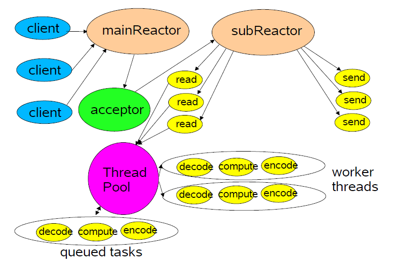

# Netty

## 1. Netty 介绍（自己查）

[Netty 官网](https://netty.io/) 

[参考资料](https://www.manning.com/books/netty-in-action?query=netty%20in%20action) 

netty 模块结构


相对而言，Netty 框架更加偏向底层，而路由转发更需要开发者自己实现

## 2. Netty Hello World 分析

HelloServer.java

```java
public class HelloServer {
    public static void main(String[] args) {
        // netty 建议用两个 LoopGroup 处理，虽然一个也可以
        EventLoopGroup bossGroup = new NioEventLoopGroup();
        EventLoopGroup workerGroup = new NioEventLoopGroup();

        try {
            // 启动服务器
            ServerBootstrap serverBootstrap = new ServerBootstrap();
            // 绑定 LoopGroup，channel，服务器初始化类
            serverBootstrap.group(bossGroup, workerGroup)
                    .channel(NioServerSocketChannel.class)
                    .childHandler(new HelloServerInitializer());
			// 同步打开监听端口
            ChannelFuture channelFuture = serverBootstrap.bind(9000).sync();
            channelFuture.channel().closeFuture().sync();
        } catch (InterruptedException e) {
            e.printStackTrace();
        } finally {
            // 静默关闭
            workerGroup.shutdownGracefully();
            bossGroup.shutdownGracefully();
        }
    }
}
```

HelloServerInitializer.java

```java
public class HelloServerInitializer extends ChannelInitializer<SocketChannel> {
    @Override
    protected void initChannel(SocketChannel ch) throws Exception {
        // 获取管道
        ChannelPipeline pipeline = ch.pipeline();
		// 添加 Http Encoder 和 Decoder
        pipeline.addLast("httpServerCodec", new HttpServerCodec());
        // 添加 HttpServerHandler
        pipeline.addLast("helloHttpServerHandler", new HelloHttpServerHandler());
    }
}
```

HelloHttpServerHandler.java

```java
public class HelloHttpServerHandler extends SimpleChannelInboundHandler<HttpObject> {
    @Override
    protected void channelRead0(ChannelHandlerContext ctx, HttpObject msg) throws Exception {
        if(msg instanceof HttpRequest) {
            // 获取请求 URI
            URI uri = new URI(((HttpRequest) msg).uri());
            // 获取请求来源地址
            System.out.println(ctx.channel().remoteAddress());
            Thread.sleep(3000);
            // 获取 msg 类
            System.out.println(msg.getClass());
            // 获取请求方法 GET POST PUT DELETE
            System.out.println(((HttpRequest) msg).method().name());
            
            // 是否是 favicon.ico 请求
            if("/favicon.ico".equals(uri.getPath())){
                System.out.println("/favicon.ico");
                return;
            }
            
            // 设置返回体
            ByteBuf content = Unpooled.copiedBuffer("Hello World !", CharsetUtil.UTF_8);
            FullHttpResponse response = new DefaultFullHttpResponse(
                // Http 协议版本
                    HttpVersion.HTTP_1_1,
                // Http 响应状态
                    HttpResponseStatus.OK,
                    content);
            response.headers().set(HttpHeaderNames.CONTENT_TYPE, "text/plain");
            response.headers().set(HttpHeaderNames.CONTENT_LENGTH, content.readableBytes());
            ctx.writeAndFlush(response);
            System.out.println("-- content --");
            ctx.close();
        }
    }

    
    // netty 的生命周期
    /* Add
     * Registered
     * Active
     * Inactive
     * Unregistered
     */
    @Override
    public void channelActive(ChannelHandlerContext ctx) throws Exception {
        System.out.println("Channel Active");
        super.channelActive(ctx);
    }

    @Override
    public void channelRegistered(ChannelHandlerContext ctx) throws Exception {
        System.out.println("Channel Registered");
        super.channelRegistered(ctx);
    }

    @Override
    public void handlerAdded(ChannelHandlerContext ctx) throws Exception {
        System.out.println();
        System.out.println("Handler Added");
        super.handlerAdded(ctx);
    }

    @Override
    public void channelInactive(ChannelHandlerContext ctx) throws Exception {
        System.out.println("Channel Inactive");
        super.channelInactive(ctx);
    }

    @Override
    public void channelUnregistered(ChannelHandlerContext ctx) throws Exception {
        System.out.println("Channel Unregistered");
        super.channelUnregistered(ctx);
    }
}
```

## 3. Netty 编写简单的 Socket

ClientInitializer

```java
public class NettyClientSocketInitializer extends ChannelInitializer<SocketChannel> {
    @Override
    protected void initChannel(SocketChannel ch) throws Exception {
        ChannelPipeline pipeline = ch.pipeline();

        pipeline.addLast(new LengthFieldBasedFrameDecoder(Integer.MAX_VALUE,0,4,0,4));
        pipeline.addLast(new LengthFieldPrepender(4));
        // 字符串编码和解码
        pipeline.addLast(new StringDecoder(CharsetUtil.UTF_8));
        pipeline.addLast(new StringEncoder(CharsetUtil.UTF_8));
        pipeline.addLast(new NettyClientSocketHandler());
    }
}
```

ClientHandler

```java
public class NettyClientSocketHandler extends SimpleChannelInboundHandler<String> {
    @Override
    protected void channelRead0(ChannelHandlerContext ctx, String msg) throws Exception {
        System.out.println(ctx.channel().remoteAddress());
        System.out.println("client output : "+msg);
        ctx.writeAndFlush("from client : " + LocalDateTime.now());
    }

    // 一定要处理异常
    @Override
    public void exceptionCaught(ChannelHandlerContext ctx, Throwable cause) throws Exception {
        cause.printStackTrace();
        ctx.close();
    }

    @Override
    public void channelActive(ChannelHandlerContext ctx) throws Exception {
        // 预先向服务端发送数据
        // 否则不会进行数据传输
        ctx.writeAndFlush("Client Connected");
    }
}
```

ServerInitializer

```java
public class NettyServerSocketInitializer extends ChannelInitializer<SocketChannel> {
    @Override
    protected void initChannel(SocketChannel ch) throws Exception {
        ChannelPipeline pipeline = ch.pipeline();

        pipeline.addLast(new LengthFieldBasedFrameDecoder(Integer.MAX_VALUE,0,4,0,4));
        pipeline.addLast(new LengthFieldPrepender(4));
        // 字符串编码解码
        pipeline.addLast(new StringDecoder(CharsetUtil.UTF_8));
        pipeline.addLast(new StringEncoder(CharsetUtil.UTF_8));
        pipeline.addLast(new NettyServerSocketHandler());
    }
}
```

ServerHandler

```java
public class NettyServerSocketHandler extends SimpleChannelInboundHandler<String> {
    @Override
    protected void channelRead0(ChannelHandlerContext ctx, String msg) throws Exception {
        System.out.println(ctx.channel().remoteAddress()+" --- "+msg);
        ctx.channel().writeAndFlush("From server : "+ UUID.randomUUID());
    }

    // 一定要处理异常
    @Override
    public void exceptionCaught(ChannelHandlerContext ctx, Throwable cause) throws Exception {
        cause.printStackTrace();
        ctx.close();
    }
}
```

__ChatSocket__ 

ServerInitializer

```java
public class ChatServerInitializer extends ChannelInitializer<SocketChannel> {
    @Override
    protected void initChannel(SocketChannel ch) throws Exception {
        ChannelPipeline pipeline = ch.pipeline();

        pipeline.addLast(new DelimiterBasedFrameDecoder(4096, Delimiters.lineDelimiter()));
        pipeline.addLast(new StringDecoder(CharsetUtil.UTF_8));
        pipeline.addLast(new StringEncoder(CharsetUtil.UTF_8));
        pipeline.addLast(new ChatServerHandler());
    }
}
```

ServerHandler

```java
public class ChatServerHandler extends SimpleChannelInboundHandler<String> {
    // netty 自己的 Channel 集合本质是 Set
    private static final ChannelGroup channelGroup = new DefaultChannelGroup(GlobalEventExecutor.INSTANCE);

    @Override
    protected void channelRead0(ChannelHandlerContext ctx, String msg) throws Exception {
        Channel channel = ctx.channel();
        channelGroup.forEach((ch)->{
            // 判断是否是自己
            if(!ch.equals(channel)){
                ch.writeAndFlush(channel.remoteAddress()+" : "+msg+"\n");
            } else {
                ch.writeAndFlush("[Self] "+msg+"\n");
            }
        });
    }

    @Override
    public void handlerAdded(ChannelHandlerContext ctx) throws Exception {
        Channel channel = ctx.channel();

        channelGroup.writeAndFlush("[Server] "+channel.remoteAddress()+" has connected\n");

        // 将连接上的 Channel 加入组里
        channelGroup.add(channel);
    }

    @Override
    public void handlerRemoved(ChannelHandlerContext ctx) throws Exception {
        Channel channel = ctx.channel();
        // 因为执行这个方法时就已经移除了，所以没必要再移除
        // channelGroup.remove(channel);
        channelGroup.writeAndFlush("[Server] "+channel.remoteAddress()+" has disconnected\n");
    }

    @Override
    public void channelActive(ChannelHandlerContext ctx) throws Exception {
        Channel channel = ctx.channel();
        System.out.println(channel.remoteAddress()+" connected");
    }

    @Override
    public void channelInactive(ChannelHandlerContext ctx) throws Exception {
        Channel channel = ctx.channel();
        System.out.println(channel.remoteAddress()+" disconnected");
    }

    @Override
    public void exceptionCaught(ChannelHandlerContext ctx, Throwable cause) throws Exception {
        ctx.close();
    }
}
```

ClientInitializer

```java
public class ChatClientInitializer extends ChannelInitializer<SocketChannel> {
    @Override
    protected void initChannel(SocketChannel ch) throws Exception {
        ChannelPipeline pipeline = ch.pipeline();

        pipeline.addLast(new DelimiterBasedFrameDecoder(4096, Delimiters.lineDelimiter()));
        pipeline.addLast(new StringDecoder(CharsetUtil.UTF_8));
        pipeline.addLast(new StringEncoder(CharsetUtil.UTF_8));
        pipeline.addLast(new ChatClientHandler());
    }
}
```

ClientHandler

```java
public class ChatClientHandler extends SimpleChannelInboundHandler<String> {
    @Override
    protected void channelRead0(ChannelHandlerContext ctx, String msg) throws Exception {
        System.out.println(msg);
    }
}
```

## 4. Netty 心跳包

Netty 有自己心跳包的类

ServerInitializer

```java
public class HeartServerInitializer extends ChannelInitializer<SocketChannel> {
    @Override
    protected void initChannel(SocketChannel ch) throws Exception {
        ChannelPipeline pipeline = ch.pipeline();
		// 空闲状态 Handler : 读空闲时间，写空闲时间，读写空闲时间，时间单位
        pipeline.addLast(new IdleStateHandler(5, 7, 3, TimeUnit.SECONDS));
        pipeline.addLast(new HeartServerHandler());
    }
}
```

ServerHandler

```java
public class HeartServerHandler extends ChannelInboundHandlerAdapter {
    @Override
    public void userEventTriggered(ChannelHandlerContext ctx, Object evt) throws Exception {
        if (evt instanceof IdleStateEvent) {
            IdleStateEvent idleStateEvent = (IdleStateEvent) evt;

            String eventType = null;
			
            switch (idleStateEvent.state()) {
                // 连接后超过读空闲时间
                case READER_IDLE:
                    eventType = "Read Idle";
                    break;
                // 连接后写过后，不写超过时间
                case WRITER_IDLE:
                    eventType = "Write Idle";
                    break;
                // 连接后不读不写超过时间
                case ALL_IDLE:
                    eventType = "ReadWrite Idle";
                    break;
            }

            System.out.println(ctx.channel().remoteAddress() + " Timeout Event : "+eventType);
            ctx.channel().close();
        }
    }
}
```

## 5. Netty WebSocket

WebSocket 是将 Http 协议升级得到

Initializer

```java
public class WebSocketServerInitializer extends ChannelInitializer<SocketChannel> {
    @Override
    protected void initChannel(SocketChannel ch) throws Exception {
        ChannelPipeline pipeline = ch.pipeline();
		// 因为是基于 Http 的所以要 Http 的 Handler
        pipeline.addLast(new HttpServerCodec());
        pipeline.addLast(new ChunkedWriteHandler());
        // 每次处理的大小
        pipeline.addLast(new HttpObjectAggregator(8192));
        // 对应 ws://~/ws 下的请求
        pipeline.addLast(new WebSocketServerProtocolHandler("/ws"));
        pipeline.addLast(new TextWebSocketServerFrameHandler());
    }
}
```

Handler

```java
public class TextWebSocketServerFrameHandler extends SimpleChannelInboundHandler<TextWebSocketFrame> {

    @Override
    protected void channelRead0(ChannelHandlerContext ctx, TextWebSocketFrame msg) throws Exception {
        System.out.println("msg : "+msg.text());

        ctx.channel().writeAndFlush(new TextWebSocketFrame("Server Time : "+ LocalDateTime.now()));
    }

    @Override
    public void handlerAdded(ChannelHandlerContext ctx) throws Exception {
        // 长 id 是唯一的，但是短 id 是不一定唯一的
        System.out.println("HandlerAdded : "+ctx.channel().id().asLongText());
    }

    @Override
    public void handlerRemoved(ChannelHandlerContext ctx) throws Exception {
        System.out.println("HandlerRemoved : "+ctx.channel().id().asLongText());
    }

    @Override
    public void exceptionCaught(ChannelHandlerContext ctx, Throwable cause) throws Exception {
        cause.printStackTrace();
        ctx.close();
    }
}
```

## 6. Google Protobuf 使用方式分析

Google 的 Protobuf 是用于 RPC 通信的

它基于一个接口协议文件，将两个语言对象的对应的属性信息

```protobuf
message Person {
  // required 必须内容， string 类型， name 名字， 1 排的位置
  required string name = 1;
  required int32 id = 2;
  optional string email = 3;
}
```

多对象定义

```protobuf
syntax = 'proto2';

package com.ayy.protobuf;

option optimize_for = SPEED;
option java_package = "com.ayy.protobuf";
option java_outer_classname = "MyDataInfo";

message MyMessage {
  enum AnimalType{
    CAT = 1;
    DOG = 2;
  }

  required AnimalType animal_type = 1;

  oneof oneOfAnimal{
    Cat cat = 2;
    Dog dog = 3;
  }
}

message Cat {
  optional string name = 1;
  optional int32 age = 2;
}

message Dog {
  optional string name = 1;
  optional int32 age = 2;
  optional string race = 3;
}
```

protobuf 版本控制

- git submodule
- git subtree

## 7. Apache Thrift 使用方式与文件编写方式分析

Thrift 文件

```thrift
namespace java com.ayy.thrift.generated

typedef i16 short
typedef i32 int
typedef i64 long
typedef bool boolean
typedef string String

struct Person {
    1: optional String username,
    2: optional int age,
    3: optional boolean married
}

exception DataException {
    1: optional String message,
    2: optional String callStack,
    3: optional String date
}

service PersonService {
    Person getPersonByUsername(1: required String username) throws (1: DataException dataException),
    void savePerson(1: required Person person) throws (1: DataException dataException)
}
```

编译

```shell
thrift --gen java xxx.thrift
```

服务端

```java
TNonblockingServerSocket serverSocket = new TNonblockingServerSocket(10000);
THsHaServer.Args arg = new THsHaServer.Args(serverSocket).minWorkerThreads(2).maxWorkerThreads(4);
PersonService.Processor<PersonServiceImpl> processor = new PersonService.Processor<>(new PersonServiceImpl());
arg.protocolFactory(new TCompactProtocol.Factory());
arg.transportFactory(new TFramedTransport.Factory());
arg.processorFactory(new TProcessorFactory(processor));
TServer server = new THsHaServer(arg);
server.serve();
```

客户端

```java
TTransport transport = new TFramedTransport(new TSocket("localhost", 10000));
TProtocol protocol = new TCompactProtocol(transport);

PersonService.Client client = new PersonService.Client(protocol);

try {
    transport.open();
    Person person = client.getPersonByUsername("me");
    client.savePerson(person1);
} catch (Exception e){
    throw new RuntimeException(e.getMessage(), e);
} finally {
    transport.close();
}
```

ServiceImpl

```java
public class PersonServiceImpl implements PersonService.Iface{}
```

## 8. Thrift 原理与架构解析

Thrift 架构

​           Client                     Server

​       Your Code               Your Code

FooService.Client  FooService.Processor   Generated Code

Foo.write()/read()     Foo.read()/write()       Generated Code

​        TProtocol               TProtocol                 Generated Code

​        TTransport            TTransport

​        ..................................................

  Underlying I/O          Underlying I/O

Thrift 传输格式

- TBInaryProtocol 二进制格式
- TCompactProtocol 压缩格式
- TJSONProtocol JSON 格式
- TSimpleJSONProtocol 提供 JSON 只写协议，生成的文件很容易通过脚本语言解析
- TDebugProtocol 使用易懂的可读文本格式，以便于 debug

Thrift 数据传输方式

- TSocket 阻塞式 Socket
- TFramedTransport 以 frame 单位为基础，非阻塞式服务中使用
- TFileTransport 以文件形式传输
- TMemoryTransport 将内存用于 I/O Java 实现时内部实际使用了简单的 ByteArrayOutputStream
- TZlibTransport 使用 zlib 进行压缩，与其他传输方式联合使用，当前 Java 无法实现

Thrift 支持的服务类型

- THsHaServer : Half Sync Half Async THsHa 引入了线程池去处理，其模型把读写任务放到线程池去处理，HA 是在处理 IO 的事件上（accept/read/write io）， HS 用于 handler 对 RPC 的同步处理，是 TNonblockingServer 的一个扩展，所以也要使用 TFramedTransport
- TNonblockingServer 多线程服务模型，使用非阻塞式 IO（需使用 TFranedTransport）
- TSimpleServer 简单的单线程服务模型，常用于测试
- TThreadPoolServer 多线程服务模型，使用标准的阻塞式 IO
- ~~TThreadSelectorServer~~ 

## 9. gRPC

### 9.1 Quick Start

下载 grpc-java

```shell
git clone -b v1.37.1 https://github.com/grpc/grpc-java
```

进入指定目录并用 gradle 安装目录命令安装目录内文件

```shell
cd grpc-java/examples
gradle installDist
```

运行服务器，然后运行客户端

```shell
./build/install/examples/bin/hello-world-server
./build/install/examples/bin/hello-world-client
```

添加服务

文件位置：`src/main/proto/helloworld.proto` 

```protobuf
// The greeting service definition.
service Greeter {
  // Sends a greeting
  rpc SayHello (HelloRequest) returns (HelloReply) {}
  // Sends another greeting
  // 这是新加的行
  rpc SayHelloAgain (HelloRequest) returns (HelloReply) {}
}

// The request message containing the user's name.
message HelloRequest {
  string name = 1;
}

// The response message containing the greetings
message HelloReply {
  string message = 1;
}
```

然后在之前的文件夹编译新的 java 文件

```shell
gradle installDist
```

客户端和服务端文件都在 `src/main/java/io/grpc/examples/helloworld/` 文件夹下

服务端代码修改

```java
  static class GreeterImpl extends GreeterGrpc.GreeterImplBase {

    @Override
    public void sayHello(HelloRequest req, StreamObserver<HelloReply> responseObserver) {
      HelloReply reply = HelloReply.newBuilder().setMessage("Hello " + req.getName()).build();
      responseObserver.onNext(reply);
      responseObserver.onCompleted();
    }

      // 这个是新加的方法，一定要重新编译，让 Interface 有这个方法再去 Override
    @Override
    public void sayHelloAgain(HelloRequest req, StreamObserver<HelloReply> responseObserver) {
      HelloReply reply = HelloReply.newBuilder().setMessage("Hello Again " + req.getName()).build();
      responseObserver.onNext(reply);
      responseObserver.onCompleted();
    }
  }
```

客户端代码修改

```java
  public void greet(String name) {
    logger.info("Will try to greet " + name + " ...");
    HelloRequest request = HelloRequest.newBuilder().setName(name).build();
    HelloReply response;
    try {
      response = blockingStub.sayHello(request);
    } catch (StatusRuntimeException e) {
      logger.log(Level.WARNING, "RPC failed: {0}", e.getStatus());
      return;
    }
    logger.info("Greeting: " + response.getMessage());
      
      // 下面是新加的代码
    try {
      response = blockingStub.sayHelloAgain(request);
    } catch (StatusRuntimeException e) {
      logger.log(Level.WARNING, "RPC failed: {0}", e.getStatus());
      return;
    }
    logger.info("Greeting: " + response.getMessage());
  }
```

重新构建加运行

```shell
gradle installDist
./build/install/examples/bin/hello-world-server
./build/install/examples/bin/hello-world-client
```

## 10. Gradle Wrapper 在 Gradle 中的使用

```shell
./gradlew # 如果没有 gradle 自动加载 gradle 然后用 gradle 构建
```

gradle-wrapper.properties

```properties
distributionBase=  # gradle 目录
distributionPath=  # gradle 位置
zipStoreBase=	   # 解压根目录
zipStorePath=      # 解压根目录
distributionUrl=   # gradle 下载的 url
```

gradle 指定 wrapper 版本

```groovy
task wrapper(type: Wrapper){
    gradleVersion = '3.4'
    distributionType = 'all' // all | bin
}
```

## 11. Java I/O 系统

### 流类

Java 程序通过流来完成输入和输出。流是生产或消费信息的抽象。

流通过 Java 的输入/输出系统与物理设备连接。尽管与它们连接的物理设备不尽相同，所有流的行为具有相同的方式，这样，相同的输入/输出类的方法适用于所有类型的外部设备。

这意味着一个输入流能够抽象多种不同类型的输入：从磁盘文件，从键盘或从网络套接字。

同样，一个输出流可以输出到控制台，磁盘文件或相连的网络。

流是处理输入/输出的一个洁净的方法，例如它不需要代码理解键盘和网络的不同。

### 输入/输出类

功能上分为两大类：输入流和输出流

结构上分为字节流和字符流

还可以分为节点流和过滤流

## 12. Java NIO 详解

Java NIO 中是面向块（block）或是缓冲区（buffer）编程

### 12.1 三个核心概念

- Selector

- Channel

- Buffer

    Buffer 本身是一块内存，底层实现上是个数组，数据读写都是通过 Buffer 来实现的

### 12.2 Buffer 重要状态属性含义与关系

- position

    下一个将要读或者写的索引，永远不会超过 limit

- limit

    指的是第一个不能被读，也不能被写的第一个元素的索引

- capacity

    由 `allocateXXX` 方法确定

Buffer 对于每个非布尔类型的基础类型都有其对应的子类

每个子类都有其相对的操作，`read()` 和 `write()` 和绝对操作 `put()` 和 `get()` 

标记和重置 `mark()` 和 `reset()` 

不变性： 0 <= mark <= position <= limit <= capacity

其他操作

- `clear()` 重置然后准备读取，虽然并不会实际擦除数据，但是目的是下次写直接覆盖之前的数据
- `flip()` 准备写
- `rewind()` 重新读取内容

### 12.3 文件通道使用

```java
public static void main(String[] args) throws Exception {
    FileInputStream inputStream = new FileInputStream("input.txt");
    FileOutputStream outputStream = new FileOutputStream("output.txt");
    
    FileChannel inputChannel = inputStream.getChannel();
    FileChannel outputChannel = outputStream.getChannel();
    
    ByteBuffer buffer = ByteBuffer.allocate(1024);
    
    while(true) {
        buffer.clear();
        
        int read = inputChannel.read(buffer);
        
        if(-1 == read){
            break;
        }
        buffer.flip();
        
        outputChannel.write(buffer);
    }
    inputChannel.close();
    outputChannel.close();
}
```

### 12.4 Buffer 使用

```java
public static void main (String[] args) {
    ByteBuffer buffer = ByteBuffer.allocate(10);
    for(int i = 0; i < buffer.capacity(); i++) {
        buffer.put((byte) i);
    }
    
    buffer.position(2);
    buffer.limit(6);
    
    ByteBuffer sliceBuffer = buffer.slice();
    
    for(int i = 0; i < sliceBuffer.capacity(); i++){
        byte b = sliceBuffer.get(i);
        b *= 2;
        sliceBuffer.put(i, b);
    }
    
    buffer.position(0);
    buffer.limit(buffer.capacity());
    
    while(buffer.hasRemaining()){
        System.out.println(buffer.get());
    }
}
```

### 12.5 只读 Buffer

```java
public static void main (String[] args) {
    ByteBuffer buffer = ByteBuffer.allocate(10);
    
    for(int i = 0; i < buffer.capacity(); i++) {
        buffer.put((byte) i);
    }
    
    ByteBuffer readonlyBuffer = buffer.asReadOnlyBuffer();
}
```

### 12.6 DirectBuffer - NIO 堆外内存零拷贝

```java
public static void main(String[] args) throws Exception {
    FileInputStream inputStream = new FileInputStream("input2.txt");
    FileOutputStream outputStream = new FileOutputStream("output2.txt");
    
    FileChannel inputChannel = inputStream.getChannel();
    FileChannel outputChannel = outputStream.getChannel();
    
    ByteBuffer buffer = ByteBuffer.allocateDirect(1024);
    
    while(true) {
        buffer.clear();
        
        int read = inputChannel.read(buffer);
        
        if(-1 == read){
            break;
        }
        buffer.flip();
        
        outputChannel.write(buffer);
    }
    inputChannel.close();
    outputChannel.close();
}
```

`allocateDirect()` 方法通过 `Unsafe` 类，在堆外直接开辟一个空间，可以让操作系统直接操作内存，少了一次数据拷贝的过程（这是因为 Java 里 new 出来的对象都是在堆上的，当要进行读写操作时，需要往系统内拷贝一份到内存中再操作）

在堆上的对象要被拷贝一份到系统内存中的原因是：在 GC 的时候，JVM 会对堆的对象进行标记，清理和压缩，在压缩的时候会移动堆内对象地址，如果不拷贝会导致读写的时候会导致 `OutOfMemoryError` ，或者只能停止 GC，但是相对而言，拷贝的速度比 IO 的速度快，所以相对而言，做拷贝性能更高

当 DirectByteBuffer 被回收时，在堆外分配的内存就会通过 JNI 释放，避免了内存泄漏的问题

文件操作堆外内存

```java
public static void main(String[] args) throws Exception{
    RandomAccessFile ramdomAccessFile = new RandomAccessFile("file", "rw");
    FileChannel fileChannel = randomAccessFile.getChannel();
    
    MappedByteBuffer mappedByteBuffer = fileChannel.map(FileChannel.MapMode.READ_WRITE, 0, 5);
    
    mappedByteBuffer.put(0, (byte)'a');
    mappedByteBuffer.put(1, (byte)'b');
    
    randomAccessFile.close();
}
```

文件操作锁

```java
public static void main(String[] args) throws Exception {
    RandomAccessFile ramdomAccessFile = new RandomAccessFile("file", "rw");
    FileChannel fileChannel = randomAccessFile.getChannel();
    
    FileLock fileLock = fileChannel.lock(3, 6, true); // begin, size, shared
    // fileLock.isValid();
    // fileLock.isShared();
    fileLock.release();
    
    randomAccessFile.close();
}
```

### 12.7 Scattering 和 Gathering

```java
public static void main(String[] args) {
    ServerSocketChannel serverSocketChannel = ServerSocketChannel.open();
    InetSocketAddress address = new InetSocketAddress(10000);
    serverSocketChannel.socket().bind(address);
    
    int messageLength = 2 + 3 + 4;
    
    ByteBuffer[] buffers = new ByteBuffer[3];
    
    buffers[0] = ByteBuffer.allocate(2);
    buffers[1] = ByteBuffer.allocate(3);
    buffers[2] = ByteBuffer.allocate(4);
    
    SocketChannel channel = serverSocketChannel.accept();
    
    while(true) {
        int bytesRead = 0;
        while(bytesRead < messageLength) {
            long r = channel.read(buffers);
            bytesRead += r;
            
            System.out.println(bytesRead);
            
            Arrays.asList(buffers).stream().map(buffer -> buffer.position + " --- " + buffer.limit).
                forEach(System.out::println);
        }
        Arrays.asList(buffers).forEach(buffer -> buffer.filp());
		
        long bytesWritten = 0;
        while(bytesWritten < messageLength) {
            long r = socketChannel.write(buffers);
            bytesWritten += r;
        }
        
        Arrays.asList(buffers).forEach(buffer -> buffer.clear());
        
        System.out.println(bytesRead);
        System.out.println(bytesWritten);
        System.out.println(messageLength);
    }
}
// 用 telnet 或者 nc 测试
```

### 12.7 Selector

```java
public static void main(String[] args) {
    int[] ports = new int[5];
    
    ports[0] = 10001;
    ports[1] = 10002;
    ports[2] = 10003;
    ports[3] = 10004;
    ports[4] = 10005;
    
    Selector selector = Selector.open();
    // SelectorProvider.provider().openSelector(); - spi
    // System.out.println(SelectorProvider.provider().getClass()); // class sun.nio.ch.KQueueSelectorProvider
    // sun.nio.ch.DefaultSelectorProvider.create().getClass(); - class sun.nio.ch.KQueueSelectorProvider
    for (int i = 0; i < ports.length; ++i) {
        ServerSocketChannel serverSocketChannel = ServerSocketChannel.open();
        serverSocketChannel.configureBlocking(false);
        ServerSocket serverSocket = serverSocketChannel.socket();
        InetSocketAddress address = new InetSocketAddress(ports[i]);
        serverSocket.bind(address);
        
        serverSocketChannel.register(selector, SelectionKey.OP_ACCEPT); // selector, ops
    }
    
    while(true) {
        int number = selector.select();
        Set<SelectionKey> selectionKeys = selector.selectedKeys();
        Iterator<SelectionKey> iter = selectionKeys.iterator();
        
        while(iter.hasNext()) {
            SelectionKey selectionKey = iter.next();
            
            if(selectionKey.isAcceptable()) {
                ServerSocketChannel serverSocketChannel = (ServerSocketChannel) seletionKey.channel();
                SocketChannel socketChannel = serverSocketChannel.accept();
                socketChannel.configureBlocking(false);
                
                socketChannel.register(selectorm SelectionKey.OP_READ);
                
                iter.remove();
            } else if(selectionKey.isReadable()) {
                SocketChannel socketChannel = (SocketChannel) selectionKey.channel();
                
                int bytesRead = 0;
                
                while(true) {
                    ByteBuffer byteBuffer = ByteBuffer.allocate(512);
                    
                    byteBuffer.clear();
                    int read = socketChannel.read(byteBuffer);
                    if(read <= 0){
                        break;
                    }
                    byteBuffer.flip();
                    
                    socketChannel.write(byteBuffer);
                    
                    bytesRead += read;
                }
            }
        }
    }
}
```

SelectionKeys

keys

selectedKeys

__Java 编解码补充__

```java
public static void main(String[] args) {
    String inputFile = "input.txt";
    String outputFile = "output.txt";
    
    RandomAccessFile input = new RandomAccessFile(inputFile, "r");
    RandomAccessFile output = new RandomAccessFile(outputFile, "rw");
    
    long inputLength = new File(inputFile).length();
    
    FileChannel inputChannel = input.getChannel();
    FileChannel outputChannel = output.getChannel();
    
    MappedByteBuffer inputData = inputFileChannel.map(FileChannel.MapMode.READ_ONLY, 0, inputLength);
    
    Charset charset = Charset.forName("utf-8");
    CharsetDecoder decoder = charset.newDecoder();
    CharsetEncoder encoder = charset.newEncoder();
    
    CharBuffer buffer = decoder.decode(inputData);
    ByteBuffer outputBuffer = encoder.encode(charBuffer);
    
    outputChannel.write(outputBuffer);
    
    input.close();
    
}
```

文件储存的时候就是 utf-8，即使经过 iso-8859-1 编码和解码，再通过 utf-8 去读取文件时，原来的字节还是没有变（因为 iso-8859-1 不会丢失任何一个字节），所以这个时候不会出现乱码

LE BE 小端与大端

文件开头以 `0xFEFF` 为 BE `0xFFFE` 为 LE （Zero Width No-Break Space）

BOM（Byte Order Mark）

### 12.8 Zero Copy

NIO 零拷贝

原先的拷贝式操作

User Space                                  Kernel Space                                                               Hardware

​         |          -- read() syscall ->            \|                                                                                   \|

​         |                                                     \|                            -- ask for data ->                          \| 

​         |                                                     \|         <- data to kernel buffer through DMA --    \| 

​         | <- copy data to user buffer     \|                                                                                   \| 

​         | --------                                           \|                                                                                   \| 

​         |         \| code logic continues     \|                                                                                   \| 

​         | <------                                           \|                                                                                   \| 

​         |                                                      \|                                                                                   \| 

​         |   write() syscall, copies data to\|                                                                                   \| 

​         |      -- kernel socket buffer ->    \|                                                                                   \| 

​         |                                                      \|                             -- write data ->                            \| 

​         |                                                      \|                             <- done --                                     \| 

​         |       <- write() returns --              \|                                                                                   \| 

 零拷贝操作

User Space                                  Kernel Space                                                               Hardware

​         |          -- sendfile() syscall ->      \|                                                                                   \|

​         |                                                     \|                            -- ask for data ->                          \| 

​         |                                                     \|         <- data to kernel buffer through DMA --    \| 

​         |                                                      \| --------                                                                       \| 

​         |                                                      \|          \| code logic continues                                 \| 

​         |                                                      \| <------                                                                        \|  

​         |                                                      \|                             -- write data ->                            \| 

​         |                                                      \|                             <- done --                                     \| 

​         |       <- sendfile() returns --        \|                                                                                   \| 

如果支持 scatter / gather

User Space                                  Kernel Space                                                                                        Hardware

​         |          -- sendfile() syscall ->      \|                                                                                                           \|

​         |                                                     \|                                          -- ask for data ->                                    \| 

​         |                                                     \|                   <- data to kernel buffer through DMA --                  \| 

​         |                                                     \|<- reads data from kernel through scatter / gather DMA --    \| 

​         |       <- sendfile() returns --       \|                                                                                                           \| 

## 13. Netty 源码分析

### 13.1 EventLoopGroup

特殊的 `EventExecutorGroup`，允许在 selection 的时候注册 `Channel` 

```java
public class NioEventLoopGroup extends MultithreadEventLoopGroup {
	// 用 SelctorProvider 创建 Selector
	public NioEventLoopGroup() {
	    this(0);
	}
}

public abstract class MultithreadEventLoopGroup extends MultithreadEventExecutorGroup implements EventLoopGroup {
    private static final int DEFAULT_EVENT_LOOP_THREADS;

    static {
        DEFAULT_EVENT_LOOP_THREADS = Math.max(1, SystemPropertyUtil.getInt(
                "io.netty.eventLoopThreads", NettyRuntime.availableProcessors() * 2));

        if (logger.isDebugEnabled()) {
            logger.debug("-Dio.netty.eventLoopThreads: {}", DEFAULT_EVENT_LOOP_THREADS);
        }
    }
    
    protected MultithreadEventLoopGroup(int nThreads, Executor executor, Object... args) {
        super(nThreads == 0 ? DEFAULT_EVENT_LOOP_THREADS : nThreads, executor, args);
    }
}

// 实例创建
public abstract class MultithreadEventExecutorGroup extends AbstractEventExecutorGroup {
    protected MultithreadEventExecutorGroup(int nThreads, Executor executor,
                                            EventExecutorChooserFactory chooserFactory, Object... args) {
        if (nThreads <= 0) {
            throw new IllegalArgumentException(String.format("nThreads: %d (expected: > 0)", nThreads));
        }

        if (executor == null) {
            executor = new ThreadPerTaskExecutor(newDefaultThreadFactory());
        }

        children = new EventExecutor[nThreads];

        for (int i = 0; i < nThreads; i ++) {
            boolean success = false;
            try {
                children[i] = newChild(executor, args);
                success = true;
            } catch (Exception e) {
                // TODO: Think about if this is a good exception type
                throw new IllegalStateException("failed to create a child event loop", e);
            } finally {
                if (!success) {
                    for (int j = 0; j < i; j ++) {
                        children[j].shutdownGracefully();
                    }

                    for (int j = 0; j < i; j ++) {
                        EventExecutor e = children[j];
                        try {
                            while (!e.isTerminated()) {
                                e.awaitTermination(Integer.MAX_VALUE, TimeUnit.SECONDS);
                            }
                        } catch (InterruptedException interrupted) {
                            // Let the caller handle the interruption.
                            Thread.currentThread().interrupt();
                            break;
                        }
                    }
                }
            }
        }

        chooser = chooserFactory.newChooser(children);

        final FutureListener<Object> terminationListener = new FutureListener<Object>() {
            @Override
            public void operationComplete(Future<Object> future) throws Exception {
                if (terminatedChildren.incrementAndGet() == children.length) {
                    terminationFuture.setSuccess(null);
                }
            }
        };

        for (EventExecutor e: children) {
            e.terminationFuture().addListener(terminationListener);
        }

        Set<EventExecutor> childrenSet = new LinkedHashSet<EventExecutor>(children.length);
        Collections.addAll(childrenSet, children);
        readonlyChildren = Collections.unmodifiableSet(childrenSet);
    }
}
```

### 13.2 Executor

DefaultThreadFactory

```java
public class DefaultThreadFactory implements ThreadFactory {
    public DefaultThreadFactory(String poolName, boolean daemon, int priority, ThreadGroup threadGroup) {
        ObjectUtil.checkNotNull(poolName, "poolName");

        if (priority < Thread.MIN_PRIORITY || priority > Thread.MAX_PRIORITY) {
            throw new IllegalArgumentException(
                    "priority: " + priority + " (expected: Thread.MIN_PRIORITY <= priority <= Thread.MAX_PRIORITY)");
        }

        prefix = poolName + '-' + poolId.incrementAndGet() + '-';
        this.daemon = daemon;
        this.priority = priority;
        this.threadGroup = threadGroup;
    }
}
```

ThreadPerTaskExecutor

```java
public final class ThreadPerTaskExecutor implements Executor {
    private final ThreadFactory threadFactory;

    public ThreadPerTaskExecutor(ThreadFactory threadFactory) {
        this.threadFactory = ObjectUtil.checkNotNull(threadFactory, "threadFactory");
    }

    @Override
    public void execute(Runnable command) {
        threadFactory.newThread(command).start();
    }
}
```

### 13.3 服务端初始化过程与反射的应用

ServerBootstrap

```java
public class ServerBootstrap extends AbstractBootstrap<ServerBootstrap, ServerChannel> {
    public ServerBootstrap group(EventLoopGroup parentGroup, EventLoopGroup childGroup) {
        super.group(parentGroup);
        if (this.childGroup != null) {
            throw new IllegalStateException("childGroup set already");
        }
        this.childGroup = ObjectUtil.checkNotNull(childGroup, "childGroup");
        return this;
    }
    
    public ServerBootstrap childHandler(ChannelHandler childHandler) {
        this.childHandler = ObjectUtil.checkNotNull(childHandler, "childHandler");
        return this;
    }
    
    // 必须要有 public 的无参构造器
    public B channel(Class<? extends C> channelClass) {
        return channelFactory(new ReflectiveChannelFactory<C>(
                ObjectUtil.checkNotNull(channelClass, "channelClass")
        ));
    }
    
    private ChannelFuture doBind(final SocketAddress localAddress) {
        final ChannelFuture regFuture = initAndRegister();
        final Channel channel = regFuture.channel();
        if (regFuture.cause() != null) {
            return regFuture;
        }

        if (regFuture.isDone()) {
            // At this point we know that the registration was complete and successful.
            ChannelPromise promise = channel.newPromise();
            doBind0(regFuture, channel, localAddress, promise);
            return promise;
        } else {
            // Registration future is almost always fulfilled already, but just in case it's not.
            final PendingRegistrationPromise promise = new PendingRegistrationPromise(channel);
            regFuture.addListener(new ChannelFutureListener() {
                @Override
                public void operationComplete(ChannelFuture future) throws Exception {
                    Throwable cause = future.cause();
                    if (cause != null) {
                        // Registration on the EventLoop failed so fail the ChannelPromise directly to not cause an
                        // IllegalStateException once we try to access the EventLoop of the Channel.
                        promise.setFailure(cause);
                    } else {
                        // Registration was successful, so set the correct executor to use.
                        // See https://github.com/netty/netty/issues/2586
                        promise.registered();

                        doBind0(regFuture, channel, localAddress, promise);
                    }
                }
            });
            return promise;
        }
    }
    
    final ChannelFuture initAndRegister() {
        Channel channel = null;
        try {
            channel = channelFactory.newChannel();
            init(channel);
        } catch (Throwable t) {
            if (channel != null) {
                // channel can be null if newChannel crashed (eg SocketException("too many open files"))
                channel.unsafe().closeForcibly();
                // as the Channel is not registered yet we need to force the usage of the GlobalEventExecutor
                return new DefaultChannelPromise(channel, GlobalEventExecutor.INSTANCE).setFailure(t);
            }
            // as the Channel is not registered yet we need to force the usage of the GlobalEventExecutor
            return new DefaultChannelPromise(new FailedChannel(), GlobalEventExecutor.INSTANCE).setFailure(t);
        }

        // 此处 config() 返回的是 ServerBootstrapConfig，group() 返回 MultithreadEventLoopGroup
        // 是由于 NioEventLoopGroup 继承了 MultithreadEventLoopGroup
        ChannelFuture regFuture = config().group().register(channel);
        if (regFuture.cause() != null) {
            if (channel.isRegistered()) {
                channel.close();
            } else {
                channel.unsafe().closeForcibly();
            }
        }

        // If we are here and the promise is not failed, it's one of the following cases:
        // 1) If we attempted registration from the event loop, the registration has been completed at this point.
        //    i.e. It's safe to attempt bind() or connect() now because the channel has been registered.
        // 2) If we attempted registration from the other thread, the registration request has been successfully
        //    added to the event loop's task queue for later execution.
        //    i.e. It's safe to attempt bind() or connect() now:
        //         because bind() or connect() will be executed *after* the scheduled registration task is executed
        //         because register(), bind(), and connect() are all bound to the same thread.

        return regFuture;
    }
}


```

ReflectiveChannelFactory

```java
public class ReflectiveChannelFactory<T extends Channel> implements ChannelFactory<T> {
    public ReflectiveChannelFactory(Class<? extends T> clazz) {
        ObjectUtil.checkNotNull(clazz, "clazz");
        try {
            this.constructor = clazz.getConstructor();
        } catch (NoSuchMethodException e) {
            throw new IllegalArgumentException("Class " + StringUtil.simpleClassName(clazz) +
                    " does not have a public non-arg constructor", e);
        }
    }
    
    @Override
    public T newChannel() {
        try {
            return constructor.newInstance();
        } catch (Throwable t) {
            throw new ChannelException("Unable to create Channel from class " + constructor.getDeclaringClass(), t);
        }
    }
}
```

### 13.4 Netty 提供的 Future 与 ChannelFuture

java.util.concurrent.Future

一个 Future 代表的是一个异步计算的结果

io.netty .... Future

继承了 jdk 1.5 的 Future 并且提供了增加 Listeners 的选项（为了把握调用 `get()` ）的时机

提供了 `isSuccess()` 方法，保证 `isDone()` 并且没有被取消，取消，失败，成功都是完成状态

ChannelFuture

```java
/*
                                        +---------------------------+
                                        | Completed successfully    |
                                        +---------------------------+
                                   +---->      isDone() = true      |
   +--------------------------+    |    |   isSuccess() = true      |
   |        Uncompleted       |    |    +===========================+
   +--------------------------+    |    | Completed with failure    |
   |      isDone() = false    |    |    +---------------------------+
   |   isSuccess() = false    |----+---->      isDone() = true      |
   | isCancelled() = false    |    |    |       cause() = non-null  |
   |       cause() = null     |    |    +===========================+
   +--------------------------+    |    | Completed by cancellation |
                                   |    +---------------------------+
                                   +---->      isDone() = true      |
                                        | isCancelled() = true      |
                                        +---------------------------+
*/
```

ChannelHandler

ChannelHandler 会被 IO 线程调用，所以不要在 ChannelHandler 里面调用 `await()` 方法，该方法会阻塞 IO 线程，因为 IO 线程里用 while 循环，会造成死循环。为了避免该情况发生，当调用 `await()` 方法时会抛出 `BlovkingOperationException` 异常

改超时与 IO 超时不同，IO 超时会在 ChannelFuture 标志为失败

### 13.5 服务器地址绑定

Options

```java
public abstract class AbstractBootstrap<B extends AbstractBootstrap<B, C>, C extends Channel> implements Cloneable {
    AbstractBootstrap(AbstractBootstrap<B, C> bootstrap) {
        group = bootstrap.group;
        channelFactory = bootstrap.channelFactory;
        handler = bootstrap.handler;
        localAddress = bootstrap.localAddress;
        synchronized (bootstrap.options) {
            options.putAll(bootstrap.options);
        }
        attrs.putAll(bootstrap.attrs);
    }
    
    static void setChannelOptions(
            Channel channel, Map.Entry<ChannelOption<?>, Object>[] options, InternalLogger logger) {
        for (Map.Entry<ChannelOption<?>, Object> e: options) {
            setChannelOption(channel, e.getKey(), e.getValue(), logger);
        }
    }
}
```


```java
public class ServerBootstrap extends AbstractBootstrap<ServerBootstrap, ServerChannel> {
    @Override
    void init(Channel channel) {
        setChannelOptions(channel, newOptionsArray(), logger);
        setAttributes(channel, newAttributesArray());

        ChannelPipeline p = channel.pipeline();

        final EventLoopGroup currentChildGroup = childGroup;
        final ChannelHandler currentChildHandler = childHandler;
        final Entry<ChannelOption<?>, Object>[] currentChildOptions = newOptionsArray(childOptions);
        final Entry<AttributeKey<?>, Object>[] currentChildAttrs = newAttributesArray(childAttrs);

        p.addLast(new ChannelInitializer<Channel>() {
            @Override
            public void initChannel(final Channel ch) {
                final ChannelPipeline pipeline = ch.pipeline();
                ChannelHandler handler = config.handler();
                if (handler != null) {
                    pipeline.addLast(handler);
                }

                ch.eventLoop().execute(new Runnable() {
                    @Override
                    public void run() {
                        pipeline.addLast(new ServerBootstrapAcceptor(
                                ch, currentChildGroup, currentChildHandler, currentChildOptions, currentChildAttrs));
                    }
                });
            }
        });
    }
}
```

### 13.6 Reactor 模式

参考书：

[Reactor An Object Behavioral Pattern for Demultiplexing and Dispatching Handles for Synchronous Events](http://www.dre.vanderbilt.edu/~schmidt/PDF/PLoP-94.pdf) 

[Scalable IO in Java](http://gee.cs.oswego.edu/dl/cpjslides/nio.pdf) 

Reactor 反应器模式

Reactor 通过分发恰当的处理器来处理 IO 线程

处理器会进行非阻塞的动作

通过将处理器绑定到事件上来管理

 

相对于 Netty，mainReactor 类比 BossGroup (ParentGroup)，可以只有一个，SubReactor 相当于 WorkGroup (ChildGroup) 

Reactor 模式连接的执行过程

1. Acceptor   register_handler()    Initiation Dispatcher
2. Initiation Dispatcher  handler_events()
3. Initiation Dispatcher  select()
4. Client  connect()  Initiation Dispatcher
5. Initiation Dispatcher  handle_event()  Acceptor
6. Acceptor  accept(), create()  Handler
7. Handler  register_handler()  Initiation Dispatcher

Reactor 模式发送数据的执行过程

1. Client A  send()  Initiation Dispatcher
2. Initiation Dispatcher handle_event()  Handler for Client A
3. Handler for Client A  recv(), write() Handler for Client B (Loop)
4. Handler for Client A  return()  Initiation Dispatcher

### 13.7 Reactor 五大角色深入分析

1. Handle

    称作句柄、描述符，本质上是一种资源，由操作系统提供，该资源用于一个个的事件，比如说文件描述符，或是针对网络的 socket 描述符

    事件既可以来自于外部，也可以来自于内部，外部事件比如客户端的连接请求，客户端发来的数据等，内部事件比如操作系统产生的定时器事件等，它本质上就是一个文件描述符

    Handle 是事件产生的发源地

2. Synchronous Event Demultiplexer

    称作同步事件分离器，本身是一个系统调用，用于等待事件的发生（一个或多个），调用方法会再调用它的时候阻塞，一直阻塞到同步事件分离器上有事件产生为止

    对于 Linux 来说，同步事件分离器指的是常用的 I/O 多路复用机制，比如 select，poll，epoll

    Java NIO 中对应的就是 Selector

3. Event Handler

    称作事件处理器，本身由多个回调方法组成，这些回调方法构成了与应用相关的对于某个事件的反馈机制

    Java NIO 中没有对应原生实现，Netty 在事件处理器这个角色上进行了一个升级，提供了大量的回调方法，供我们在特定事件产生时实现相应的回调方法进行业务逻辑的处理
    
4. Concrete Event Handler

    称作具体事件处理器，是事件处理器的实现，它本身实现了事件处理器所提供的各个回调方法，从而实现了特定于业务逻辑，它本质上就是我们所编写的一个个处理器的实现

5. Initiation Dispatcher

    称作初始分发器，它实际上就是 Reactor 角色，它本身定义了一些规范，这些规范用于控制事件的调度方式，同时又提供了应用进行事件处理器的注册，删除等设施

    它本身是整个事件处理器的核心所在，它会通过同步事件分离器来等待事件的发生，一旦事件发生，它首先分离出每一个事件，然后调用事件处理器，最后调用相关的回调方法来处理这些事件

首先 Initiation Dispatcher 在启动后，首先将若干个 Event Handler 注册在其上，注册同时指定感兴趣事件（由 Handler 决定），并开启事件死循环，并且通过 Synchronous Event Demultuplexer 等待事件产生，当感兴趣事件发生时，通过 Initiation Dispatcher 去选择并触发对应的 Concrete Event Handler 的回调方法，从而响应处于 Ready 状态的 Handler 并且将这个 Handler 作为 key 并分发恰当的事件处理方法，从而响应这个事件，所发生类型可以作为该方法参数并被该方法内部使用来执行额外的特定服务的分离与分发

与 Netty 的对应关系

Initiation Dispatcher：mainReactor 与 subReactor（两个 EventGroup）Acceptor 用于 mainReactor 接受连接以后将任务交给 subReactor

## 14. Netty 自适应缓冲区分配策略与对外内存的创建方式

DefaultChannelConfig

```java
public class DefaultChannelConfig implements ChannelConfig {
    public DefaultChannelConfig(Channel channel) {
        // 根据前一次读取大小来调节缓冲区大小
        this(channel, new AdaptiveRecvByteBufAllocator());
    }

    protected DefaultChannelConfig(Channel channel, RecvByteBufAllocator allocator) {
        setRecvByteBufAllocator(allocator, channel.metadata());
        this.channel = channel;
    }
}
```

AdaptiveRecvByteBufAllocator

```java
public class AdaptiveRecvByteBufAllocator extends DefaultMaxMessagesRecvByteBufAllocator {

    static final int DEFAULT_MINIMUM = 64;
    // Use an initial value that is bigger than the common MTU of 1500
    static final int DEFAULT_INITIAL = 2048;
    static final int DEFAULT_MAXIMUM = 65536;
    
    static {
        List<Integer> sizeTable = new ArrayList<Integer>();
        // 先存储可分配的缓冲区大小
        for (int i = 16; i < 512; i += 16) {
            sizeTable.add(i);
        }
        // Suppress a warning since i becomes negative when an integer overflow happens
        for (int i = 512; i > 0; i <<= 1) { // lgtm[java/constant-comparison]
            sizeTable.add(i);
        }

        SIZE_TABLE = new int[sizeTable.size()];
        for (int i = 0; i < SIZE_TABLE.length; i ++) {
            SIZE_TABLE[i] = sizeTable.get(i);
        }
    }
    
    public AdaptiveRecvByteBufAllocator() {
        this(DEFAULT_MINIMUM, DEFAULT_INITIAL, DEFAULT_MAXIMUM);
    }
    
    public AdaptiveRecvByteBufAllocator(int minimum, int initial, int maximum) {
        checkPositive(minimum, "minimum");
        if (initial < minimum) {
            throw new IllegalArgumentException("initial: " + initial);
        }
        if (maximum < initial) {
            throw new IllegalArgumentException("maximum: " + maximum);
        }

        int minIndex = getSizeTableIndex(minimum);
        if (SIZE_TABLE[minIndex] < minimum) {
            this.minIndex = minIndex + 1;
        } else {
            this.minIndex = minIndex;
        }

        int maxIndex = getSizeTableIndex(maximum);
        if (SIZE_TABLE[maxIndex] > maximum) {
            this.maxIndex = maxIndex - 1;
        } else {
            this.maxIndex = maxIndex;
        }

        this.initial = initial;
    }
    
	private final class HandleImpl extends MaxMessageHandle {
        public int guess() {
            return nextReceiveBufferSize;
        }

        private void record(int actualReadBytes) {
            if (actualReadBytes <= SIZE_TABLE[max(0, index - INDEX_DECREMENT)]) {
                if (decreaseNow) {
                    index = max(index - INDEX_DECREMENT, minIndex);
                    nextReceiveBufferSize = SIZE_TABLE[index];
                    decreaseNow = false;
                } else {
                    decreaseNow = true;
                }
            } else if (actualReadBytes >= nextReceiveBufferSize) {
                index = min(index + INDEX_INCREMENT, maxIndex);
                nextReceiveBufferSize = SIZE_TABLE[index];
                decreaseNow = false;
            }
        }
    }
}
```

缓冲区分配

```java
public abstract class DefaultMaxMessagesRecvByteBufAllocator implements MaxMessagesRecvByteBufAllocator {
    public abstract class MaxMessageHandle implements ExtendedHandle {
        public ByteBuf allocate(ByteBufAllocator alloc) {
            return alloc.ioBuffer(guess());
        }
    }
}
```

alloc.ioBuffer()

```java
public abstract class AbstractByteBufAllocator implements ByteBufAllocator {
    public ByteBuf ioBuffer(int initialCapacity) {
        if (PlatformDependent.hasUnsafe() || isDirectBufferPooled()) {
            return directBuffer(initialCapacity);
        }
        return heapBuffer(initialCapacity);
    }
    
    public ByteBuf directBuffer(int initialCapacity, int maxCapacity) {
        if (initialCapacity == 0 && maxCapacity == 0) {
            return emptyBuf;
        }
        validate(initialCapacity, maxCapacity);
        return newDirectBuffer(initialCapacity, maxCapacity);
    }
}
```

申请内存

```java
public class UnpooledDirectByteBuf extends AbstractReferenceCountedByteBuf {
    public UnpooledDirectByteBuf(ByteBufAllocator alloc, int initialCapacity, int maxCapacity) {
        super(maxCapacity);
        ObjectUtil.checkNotNull(alloc, "alloc");
        checkPositiveOrZero(initialCapacity, "initialCapacity");
        checkPositiveOrZero(maxCapacity, "maxCapacity");
        if (initialCapacity > maxCapacity) {
            throw new IllegalArgumentException(String.format(
                    "initialCapacity(%d) > maxCapacity(%d)", initialCapacity, maxCapacity));
        }

        this.alloc = alloc;
        setByteBuffer(allocateDirect(initialCapacity), false);
    }
    
    protected ByteBuffer allocateDirect(int initialCapacity) {
        // java.nio
        return ByteBuffer.allocateDirect(initialCapacity);
    }
}
```

## 15. Channel 与 ChannelPipeline

Channel 可以理解为一个网络套接字 socket 的连接点，或者是一个能够提供 IO 操作的组件（比如读，写，连接，绑定等）

Channel 给用户提供了

- 当前 Channel 状态（连接？打开？）
- Channel 的配置信息
- Channel 支持的 IO 操作
- 将 Handler 组合起来的 ChannelPipeline

所有的 IO 操作都是异步的，任何 IO 调用都会立即返回

ChannelPipeline 创建时机：在 channelFactory.newChannel() 的时候 new AbstractChannel 内部创建 ChannelPipeline

```java
public abstract class AbstractChannel extends DefaultAttributeMap implements Channel {
    private final DefaultChannelPipeline pipeline;
    
    protected AbstractChannel(Channel parent) {
        this.parent = parent;
        id = newId();
        unsafe = newUnsafe();
        pipeline = newChannelPipeline();
    }
    
    protected DefaultChannelPipeline newChannelPipeline() {
        return new DefaultChannelPipeline(this);
    }
}
```

ChannelPipeline 创建

```java
public class DefaultChannelPipeline implements ChannelPipeline {
    protected DefaultChannelPipeline(Channel channel) {
        this.channel = ObjectUtil.checkNotNull(channel, "channel");
        succeededFuture = new SucceededChannelFuture(channel, null);
        voidPromise =  new VoidChannelPromise(channel, true);

        tail = new TailContext(this);
        head = new HeadContext(this);

        head.next = tail;
        tail.prev = head;
    }
}
```

ChannelPipeline 是一些 ChannelHandler 的集合，用来拦截 Channel 进和出的事件进行操作（Interceptor - Filter Pattern）

InBoundHandler 是按添加顺序进行拦截

OutBoundHandler 是按添加顺序倒序进行拦截

ChannelInitializer\<T\> 中 ChannelPipeline 对 Handler 的添加

在 ChannelInitializer 完成对 Handler 的添加后，将自己从 ChannelPipeline 中移除（因为本身并不是处理器，是一个添加处理器的封装）

```java
public class DefaultChannelPipeline implements ChannelPipeline {
    // 这里维护了一个 handler 名称的 cache
    private static final FastThreadLocal<Map<Class<?>, String>> nameCaches =
            new FastThreadLocal<Map<Class<?>, String>>() {
        @Override
        protected Map<Class<?>, String> initialValue() {
            return new WeakHashMap<Class<?>, String>();
        }
    };
    
    @Override
    public final ChannelPipeline addLast(EventExecutorGroup group, String name, ChannelHandler handler) {
        final AbstractChannelHandlerContext newCtx;
        synchronized (this) {
            checkMultiplicity(handler);

            newCtx = newContext(group, filterName(name, handler), handler);

            addLast0(newCtx);

            // If the registered is false it means that the channel was not registered on an eventLoop yet.
            // In this case we add the context to the pipeline and add a task that will call
            // ChannelHandler.handlerAdded(...) once the channel is registered.
            // 此处的意思是，如果 handler 没有被加上时，会挂起一个 task 去添加 handler，然后直接返回
            if (!registered) {
                newCtx.setAddPending();
                callHandlerCallbackLater(newCtx, true);
                return this;
            }

            EventExecutor executor = newCtx.executor();
            if (!executor.inEventLoop()) {
                callHandlerAddedInEventLoop(newCtx, executor);
                return this;
            }
        }
        callHandlerAdded0(newCtx);
        return this;
    }
    
    private void addLast0(AbstractChannelHandlerContext newCtx) {
        AbstractChannelHandlerContext prev = tail.prev;
        newCtx.prev = prev;
        newCtx.next = tail;
        prev.next = newCtx;
        tail.prev = newCtx;
    }
    
    // 确定 handler 是否已经存在
    private static void checkMultiplicity(ChannelHandler handler) {
        if (handler instanceof ChannelHandlerAdapter) {
            ChannelHandlerAdapter h = (ChannelHandlerAdapter) handler;
            if (!h.isSharable() && h.added) {
                throw new ChannelPipelineException(
                        h.getClass().getName() +
                        " is not a @Sharable handler, so can't be added or removed multiple times.");
            }
            h.added = true;
        }
    }
    
    private void callHandlerAdded0(final AbstractChannelHandlerContext ctx) {
        try {
            // handler 在这里才被真正地添加上
            ctx.callHandlerAdded();
        } catch (Throwable t) {
            boolean removed = false;
            try {
                atomicRemoveFromHandlerList(ctx);
                ctx.callHandlerRemoved();
                removed = true;
            } catch (Throwable t2) {
                if (logger.isWarnEnabled()) {
                    logger.warn("Failed to remove a handler: " + ctx.name(), t2);
                }
            }

            if (removed) {
                fireExceptionCaught(new ChannelPipelineException(
                        ctx.handler().getClass().getName() +
                        ".handlerAdded() has thrown an exception; removed.", t));
            } else {
                fireExceptionCaught(new ChannelPipelineException(
                        ctx.handler().getClass().getName() +
                        ".handlerAdded() has thrown an exception; also failed to remove.", t));
            }
        }
    }
}
```

Channel 注册

```java
public abstract class AbstractBootstrap<B extends AbstractBootstrap<B, C>, C extends Channel> implements Cloneable {
    final ChannelFuture initAndRegister() {
        Channel channel = null;
        try {
            channel = channelFactory.newChannel();
            init(channel);
        } catch (Throwable t) {
            if (channel != null) {
                channel.unsafe().closeForcibly();
                return new DefaultChannelPromise(channel, GlobalEventExecutor.INSTANCE).setFailure(t);
            }
            return new DefaultChannelPromise(new FailedChannel(), GlobalEventExecutor.INSTANCE).setFailure(t);
        }
        // 这里是注册的部分
        ChannelFuture regFuture = config().group().register(channel);
        if (regFuture.cause() != null) {
            if (channel.isRegistered()) {
                channel.close();
            } else {
                channel.unsafe().closeForcibly();
            }
        }
        return regFuture;
    }
}
```

group().register(channel)

```java
public abstract class MultithreadEventLoopGroup extends MultithreadEventExecutorGroup implements EventLoopGroup {
    @Override
    public EventLoop next() {
        return (EventLoop) super.next();
    }
    
    @Override
    public ChannelFuture register(Channel channel) {
        // next() 返回一个 EventGroup
        return next().register(channel);
    }
}
```

next()

```java
public abstract class MultithreadEventExecutorGroup extends AbstractEventExecutorGroup {
    private final EventExecutorChooserFactory.EventExecutorChooser chooser;
    
    // choose 初始化地方
    protected MultithreadEventExecutorGroup(int nThreads, Executor executor,
                                            EventExecutorChooserFactory chooserFactory, Object... args) {
        if (nThreads <= 0) {
            throw new IllegalArgumentException(String.format("nThreads: %d (expected: > 0)", nThreads));
        }

        if (executor == null) {
            executor = new ThreadPerTaskExecutor(newDefaultThreadFactory());
        }

        children = new EventExecutor[nThreads];

        for (int i = 0; i < nThreads; i ++) {
            boolean success = false;
            try {
                children[i] = newChild(executor, args);
                success = true;
            } catch (Exception e) {
                // TODO: Think about if this is a good exception type
                throw new IllegalStateException("failed to create a child event loop", e);
            } finally {
                if (!success) {
                    for (int j = 0; j < i; j ++) {
                        children[j].shutdownGracefully();
                    }

                    for (int j = 0; j < i; j ++) {
                        EventExecutor e = children[j];
                        try {
                            while (!e.isTerminated()) {
                                e.awaitTermination(Integer.MAX_VALUE, TimeUnit.SECONDS);
                            }
                        } catch (InterruptedException interrupted) {
                            // Let the caller handle the interruption.
                            Thread.currentThread().interrupt();
                            break;
                        }
                    }
                }
            }
        }

        chooser = chooserFactory.newChooser(children);

        final FutureListener<Object> terminationListener = new FutureListener<Object>() {
            @Override
            public void operationComplete(Future<Object> future) throws Exception {
                if (terminatedChildren.incrementAndGet() == children.length) {
                    terminationFuture.setSuccess(null);
                }
            }
        };

        for (EventExecutor e: children) {
            e.terminationFuture().addListener(terminationListener);
        }

        Set<EventExecutor> childrenSet = new LinkedHashSet<EventExecutor>(children.length);
        Collections.addAll(childrenSet, children);
        readonlyChildren = Collections.unmodifiableSet(childrenSet);
    }
    
    @Override
    public EventExecutor next() {
        return chooser.next();
    }
}
```

EventExecutorChooserFactory

```java
@UnstableApi
public interface EventExecutorChooserFactory {

    /**
     * Returns a new {@link EventExecutorChooser}.
     */
    EventExecutorChooser newChooser(EventExecutor[] executors);

    /**
     * Chooses the next {@link EventExecutor} to use.
     */
    @UnstableApi
    interface EventExecutorChooser {

        /**
         * Returns the new {@link EventExecutor} to use.
         * 返回一个新的可用的 EventExecutor 对象
         */
        EventExecutor next();
    }
}
```

实现

```java
/**
 * Default implementation which uses simple round-robin to choose next {@link EventExecutor}.
 * 负载均衡 round-robin 轮询算法
 */
@UnstableApi
public final class DefaultEventExecutorChooserFactory implements EventExecutorChooserFactory {
    public static final DefaultEventExecutorChooserFactory INSTANCE = new DefaultEventExecutorChooserFactory();

    private DefaultEventExecutorChooserFactory() { }

    // 判断数组是否是 2 的幂次方来决定轮询c
    @Override
    public EventExecutorChooser newChooser(EventExecutor[] executors) {
        if (isPowerOfTwo(executors.length)) {
            return new PowerOfTwoEventExecutorChooser(executors);
        } else {
            return new GenericEventExecutorChooser(executors);
        }
    }

    private static boolean isPowerOfTwo(int val) {
        return (val & -val) == val;
    }

    private static final class PowerOfTwoEventExecutorChooser implements EventExecutorChooser {
        private final AtomicInteger idx = new AtomicInteger();
        private final EventExecutor[] executors;

        PowerOfTwoEventExecutorChooser(EventExecutor[] executors) {
            this.executors = executors;
        }

        @Override
        public EventExecutor next() {
            return executors[idx.getAndIncrement() & executors.length - 1];
        }
    }

    private static final class GenericEventExecutorChooser implements EventExecutorChooser {
        // Use a 'long' counter to avoid non-round-robin behaviour at the 32-bit overflow boundary.
        // The 64-bit long solves this by placing the overflow so far into the future, that no system
        // will encounter this in practice.
        private final AtomicLong idx = new AtomicLong();
        private final EventExecutor[] executors;

        GenericEventExecutorChooser(EventExecutor[] executors) {
            this.executors = executors;
        }

        @Override
        public EventExecutor next() {
            return executors[(int) Math.abs(idx.getAndIncrement() % executors.length)];
        }
    }
}
```


## 16. Netty 常量池实现及 ChannelOption 与 Attribute

常量维护

```java
public abstract class ConstantPool<T extends Constant<T>> {
    private final ConcurrentMap<String, T> constants = PlatformDependent.newConcurrentHashMap();

    private final AtomicInteger nextId = new AtomicInteger(1);
    
    // 创建常量
    private T getOrCreate(String name) {
        T constant = constants.get(name);
        if (constant == null) {
            final T tempConstant = newConstant(nextId(), name);
            constant = constants.putIfAbsent(name, tempConstant);
            if (constant == null) {
                return tempConstant;
            }
        }
        return constant;
    }
}
```

ChannelOption\<T\>，AttributeKey\<T\> 中不存值，只储存 Option 的类型：T

ChannelOption 主要维护了 TCP/IP 的配置

Attribute 维护了业务数据，用于 Handler 之间的通信

## 17. ChannelHandlerContext 

ChannelHandlerContext 是一个桥梁，它可以直接获取 Channel，ChannelPipeline 和 ChannelHandler

*从 Netty 4.1 开始，ChannelHandlerContext.attr() == Channel.attr()

​	即在 Netty 里，原本每个 Handler 对应一个 ChannelHandlerContext，其中每一个都维护了自己的 Map，而现在是 Channel 和所有的 ChannelHandlerContext 公用同一个 Map

## Netty 大文件传送支持

## 可扩展事件模型

## Netty 统一通信 API

## 零拷贝在 Netty 中的实现与支持

## TCP 粘包与拆包解析

## NIO 模型在 Netty 中的实现

## Netty 编解码开发技术

## Netty 重要类与接口源代码解析

## Channel 分析

## 序列化讲解


