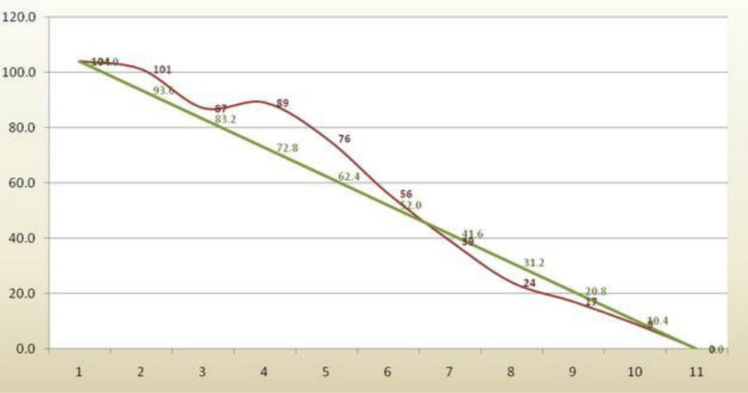
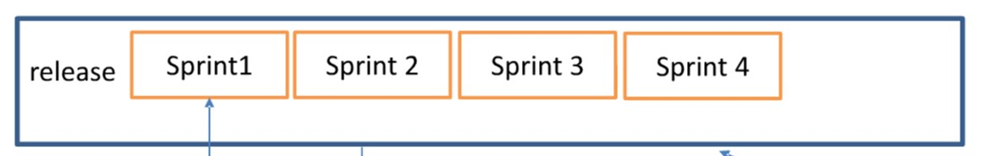
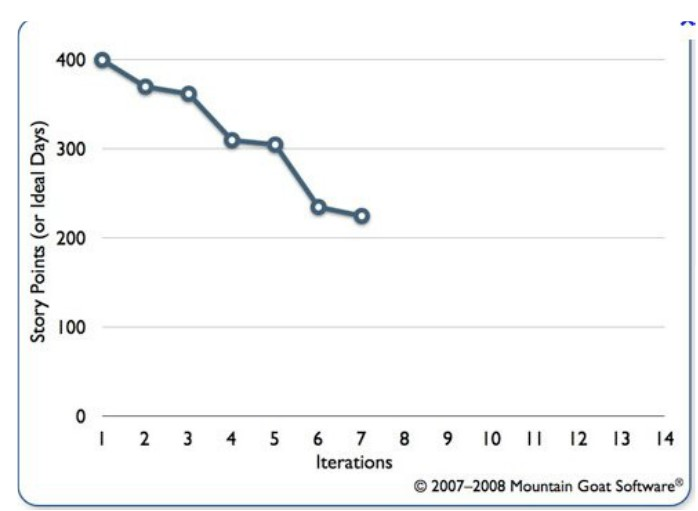
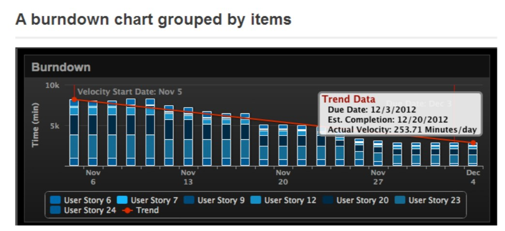

# 敏捷开发 - Scrum

## 1. Scrum 中的元素

- Role 角色

  - Product Owner (PO) 

  - Scrum Master 

  - Team

    目的： 优化开发的灵活性和生产力

- Timeboxs  时间表 （重点在于迭代的 Sprint 冲刺，或者称为任务）

  - Release Plan 发布计划
  - Sprint Plan 冲刺计划
  - SCRUM quotidien 每日工作
  - Sprint Review 项目反馈
  - Retrospective 回顾

- Artefacts 

  - Backlog 积压

    - product 产品积压
    - sprint 任务挤压

  - Plan 计划

    - release 发布计划
    - sprint 任务计划

  - Burndown 完成

    - sprint 任务完成
    - release 发布完成

    

    完成图：横轴 - 天，纵轴 - 剩余工作量

- 实现方式

  

  一个 release 由数个 sprint 的 timebox 组成，一个 timebox 持续 2~3 周，经过几个月后，整个产品可以变成一个可发布的产品

  - 活动（这些活动在每个 sprint 里是同时进行的）
    - 分析，特殊声明
    - 构思，计划
    - 代码，测试代码
    - 测试，验收

## 2. Scrum 中的角色

- Product Owner

  - 不同于传统的项目领头人，他关系到更多的事情
  - 根据组织结构不同，他必须
    - 给予产品一个共同认可的观点
    - 定于产品内容
    - 管理产品的生命周期
  - 他代表着一种职业，他可以给予团队他的观点
  - 有快速做决定的能力
  - 有在合适情况下详细列出需求的能力
  - 有灵活应变，接受他人观点的开放精神
  - 有谈判协商的能力

- Scrum Master

  - 团队的促进者
  - 帮助团队流畅地实现 Scrum 方法
  - 监管 Scrum 的实际应用
  - 鼓励团队学习，进步
  - 能想办法解决团队障碍
  - 激发团队的独立自主能力

  对管理的基础有影响

- Team

  - 6 到 10 个人
  - 独立，有责任感，没有独裁制度
  - 没有特殊的专家
  - 定义组织方式
  - 定义完成任务图
  - 应该为了完成项目共同进步
  - 主张团队性的奖赏

## 3. 如何描述需求

- Feature 特征

  - 使用需求管理的方式描述

  - 定义

    一个特征是一个系统给予的服务，是外部可见的，用来适应一个需求，这个需求的解释应该在所有利益相关者都可以轻松理解其含义的层面

  - 识别

    它由 Team 成员或者产品研发参与者构思，它被细分成 Stories

  - 包含内容

    - 名字
    - 描述
    - 日期
    - 利益
    - 相关的 Stories
    - 比重（即每个 Story 比重的总和）

- Stories

  - 不同形式

    - User Story 用户
      - 描述一种行为
    - Technical Story 技术
      - 用户不可见
      - 仅开发团队可见
    - Defect 缺陷
      - 要处理的缺陷

  - 状态：Story 的生命周期

    创建->接受->评估->计划->进行->结束

  - 包含内容

    - 名字
    - 描述
    - 日期
    - 形式（user，technical，defect）
    - 状态（created，accepted，estimated，planned，going，end）
    - 比重
    - B.V.P 100~1000 Business Value Points 工作价值点数

- Product backlog 产品积压

  - 包含有且仅有一个优先做的 Stories 列表
    - Team 是参与优先优先次序，Product Owner 是负责人
  - 并非一成不变的（随着产品声明周期变化）
  - 所有人可以参与
  - 用于
    - 项目管理
    - 需求管理
    - 构思，代码，测试

## 4. 如何详细说明需求

- 用户的角色

  - 区别角色

    - 谁给予，使用信息
    - 谁用软件
    - 这个软件和什么其它的系统相互左右
    - ......

  - 角色

    一个角色是一个用户形式，一个假定的目标用户的代表，它可以帮助我们决定优先次序和帮助我们决定交互界面的构思

- Stories

  - 区别 stories

    - 将 feature 拆分成多个 stories

    - 用特征和角色表

    - 为了让读者（团队）容易理解并去开发功能，我们给每个 Story 一个固定的描述格式

      作为 （谁）...，我希望在（什么情况下）...，达成（目标）...，原因是（为什么）...

- 可追溯性

  - 可追溯性是连接不同项目元素的能力，用来判断某个修改的影响

    Feature ---- 分解为 ---> Story ---- 细化成 ----> 测试

    ​                                                   ---- 被实现 ----> Task 任务

## 5. 如何识别 Task 任务

- Task 的特征

  - Tasks 可以演绎一些 Stories

  - 它独立于 Stories 或 Storyless

    - 准时进行的事件

    - 为部署软件的工作

    - 为测试提供数据

    - 提升产品质量

      会议不被包括在 Task 中

- 着手做 Task

  - Team 自己做 Task 而并不是被分配

- 包含内容

  - 名字和要做的工作
  - 相关的 Story
  - 谁做的工作

- 每个 Story 中包含相似的 Task 的内容

  - 构思
  - 交互界面设计
  - 代码
  - 测试

## 6. Test 测试

- 测试总是被集成于每个 sprint 

- 测试验收是在 sprint 结束后对一些 stories 的验收，步骤为

  - 描述预期表现
  - 将这些条件转换成测试情形（storytest）
  - 写出实现这些表现的相关代码
  - 进行 storytest

- 一个 Story 可以有数个测试，一般为 2-8 个

- 测试进行的步骤

  定义一个满足条件 -> 写 storytest -> 开发 story 的代码 -> 将这些代码进行测试

  storytest 必须先被 Product Owner 验收

- 定义满足条件

  - 如果一个条件没被满足，那么这个 story 不视为完成

- 写 storytest

  - 使用 BDD（Bahavior Driven Development） 方法

    在（先前情况）...，当（什么操作）...，然后（结构）

  - storytest 必须和代码在一个 sprint 里面完成

  - 整个 Team 可以着手写 storytest

- 开发 story 代码

  - Team 从验收测试角度出发，来构思并编写代码（即先有测试代码大概轮廓然后有产品代码，然后再不断改测试）

- 进行测试

  - 用于确定一个 story 是否结束了
  - 它和开发的代码在一个 sprint 周期里进行
  - 如果可能的话，让测试代码能够自动测试（预填充数据）

- 总结

  - 每个 sprint 周期都有测试验收
  - 测试代码可以帮助写产品代码
  - storytest 是由 Team 通过举详细例子来实现的

## 7. 评估 Story 的大小和益处

- 每个 story backlog story 积压必须被评估

- 共同评估方式：poker 计划

  - 每个参与者收到一套有数字的卡片

  - 每张卡片有可能的 story 评估值
  - Product Owner 介绍这个 Story
  - Team 提出问题来更好地理解以及简短地讨论
  - 所有参与这同时展示他们地评估卡片
  - 参与者讨论不同评估值地原因
  - 重新进行评估直到所有人达成相同的评估值，然后接着评估下一个 story

- 评估利益

  - 要将利益最大化

  - 使用 MoSCoW 方法

    | 在 Sprint 中的 % | Business Value Points | 值     | 详细                                 |
    | ---------------- | --------------------- | ------ | ------------------------------------ |
    | 19%              | 900 - 1000            | Must   | 必须有，最大的值，如果没有就代表失败 |
    | 17%              | 700 - 800             | Should | 应该拥有                             |
    | 35%              | 400 - 600             | Could  | 可以拥有，是希望有，但是不是必需品   |
    | 29%              | 100 - 300             | Would  | 非必要的                             |

- 决定一个 sprint 的周期的因素

  - 与用户和客户有关
  - Team 的大小
  - 最后发布日期
  - 要随机应变的时间
  - 保持团队的积极性

## 8. 规划一个 sprint

- 通过 stories 的评估来区分
  - Product backlog 产品积压是做计划不可避免考虑的部分
  - 用于度量最后一个 sprint 来估算开始的 sprint
    - 速度：评估 Team 在一个 sprint 里可以完成的 backlog 
    - 容量：预测团队可以做的工作量
- 规划由 Team 来决定
  - 规则：由 Product Owner 来决定优先任务
  - 区分 Task：每个 Story 被细分成多个 Task
    - 所有 story 的开发活动必须被考虑到
  - 着手做 Task：每个 Team 成员自己选择 Task 去做
- Task 表格
  - 用于展示工作进度
  - 有 3 种状态：要做，正在进行，已结束
- 如何规划一个好的 plan
  - 准备 backlog 积压
  - 分解到小的 Task
  - 保持放松
  - 计划：构思，交互，业务，测试
- 结果
  - product backlog 产品积压内容被实现：sprint 的 stories 可以到正在进行的状态
- 总结
  - sprint 的规划是在 sprint 的第一个会议时进行的
  - 这不仅仅是一次规划，还是一个 Team 学习自我组合以及分享知识期间的集体练习

## 9. Retrospective 反思

- 定义

  - 反思是一种在某一步骤结束时的惯例，用于获得更多的知识和在下一步中能优化自己的产品

- 持续改进实践

  - 在每个 sprint 的结束时，整个团队参与这个实践
    - 理解并改善需求
    - 构思优化内容
    - 积极地应用这些优化
    - 定义优先优化的内容

- 结果

  - 通过每个人的方向来分类行为表 action list

    - 人

    - 工具

    - 质量

      | 要做                     | 不要做                       |
      | ------------------------ | ---------------------------- |
      | 要说出哪些做得好         | 记账（指所有都逐一记下来）   |
      | 集中于一个优化           | 一次优化所有内容             |
      | 在发布结尾要更深刻的反思 | 对于已经有的行为内容经行反思 |

  - 反思并不是强迫要做的事，由团队决定

    

## 10. 指南和度量

- 什么时候设置度量

  - 每天（对于正在进行的 sprint）
    - 剩余要完成的 Task
    - 剩余要完成的 story
    - 剩余要完成的 story points
  - 每个 sprint
    - 在 sprint 开始时，sprint 的量
    - 实际做 sprint 时的速度
    - sprint 整体的 B.V.P
    - 已经完成的 story
    - 实现的 story points
  - 每个发布
    - 和 sprint 同样的事

- sprint 质量的指南

  - 增加/修改/删除的 sprint 数量
  - 偏差的数量
  - 平均解决偏差问题的时间
  - 每个 story 评估的平均间距

- sprint 的指南方式通过一张任务图

  

  ​	

## 11. 结束的标志

- 不完善结束的影响
  - 在 story 中有 bug
  - 技术负债
  - 在发布结尾推迟
- 所有的团队必须参与结束的标志
- 定义并公布检查表和使用
- story 的结束
- 单元验收测试能在同一个 sprint 里成功
  - Task 和 Story 相关
- sprint 结束
  - story 全部结束
  - code 实现需求
  - 构思实现需求
- release 结束
  - 产品的状态处于 release 的末尾
- 一个结束描述了产品在一个 sprint 或者 release 结束的预期状态
  - 一个好的实现
    - 积极的团队
    - 优化产品质量

